# BV Node Pack (ComfyUI)

A small collection of quality-of-life nodes for ComfyUI.

> ⚠️ Note: This pack includes UI logic (JavaScript) for dynamic node updates (also works in Subgraphs/Subflows).

---

## Installation

Clone into your ComfyUI `custom_nodes` folder:

```bash
cd ComfyUI/custom_nodes
git clone https://github.com/BlackVortexAI/bv_nodepack.git
```

Restart ComfyUI and (if needed) hard refresh the browser: **Ctrl+F5**

### Uninstall
- Delete the folder in `custom_nodes`
- Restart ComfyUI
- Hard refresh the browser (Ctrl+F5)

---

## Update

```bash
cd ComfyUI/custom_nodes/bv_node_pack
git pull
```

Restart ComfyUI (recommended).

---

## Nodes / Features

### BV Pipe Config
Defines the slot layout (names) for a BV Pipe.

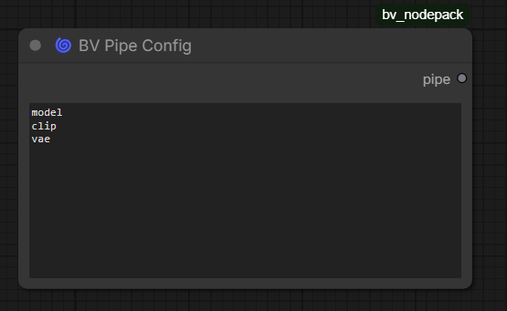

**What it does**
- Define slot names (1 per line, max 100)
- Outputs a single `BV_PIPE` object ("the pipe") used downstream

**How to use**
1. Add **BV Pipe Config**
2. Enter slot names (one per line)
3. Connect its `pipe` output to **BV Pipe**

---

### BV Pipe
A config-driven carrier node that forwards one pipe connection while exposing named slots.

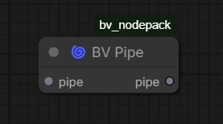

**What it does**
- Shows only the slots defined by the connected **BV Pipe Config**
- Lets you override individual slots, while everything else passes through

**Override example**

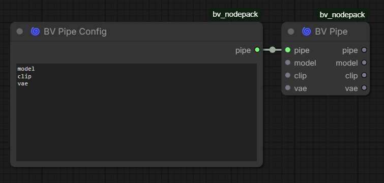

**Subgraph example**

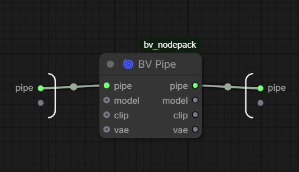

---

### BV Subgraph Heading
A UI node that renders a bold header text inside the node.
Designed to work well inside **Subgraphs/Subflows**: when exposed, the header is also rendered on the Subgraph node in the main graph.

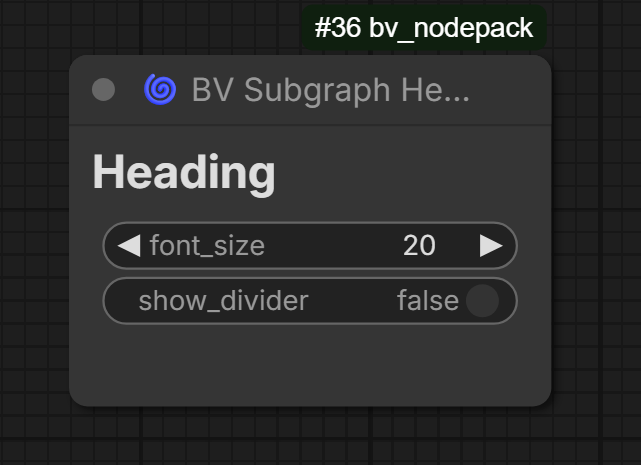

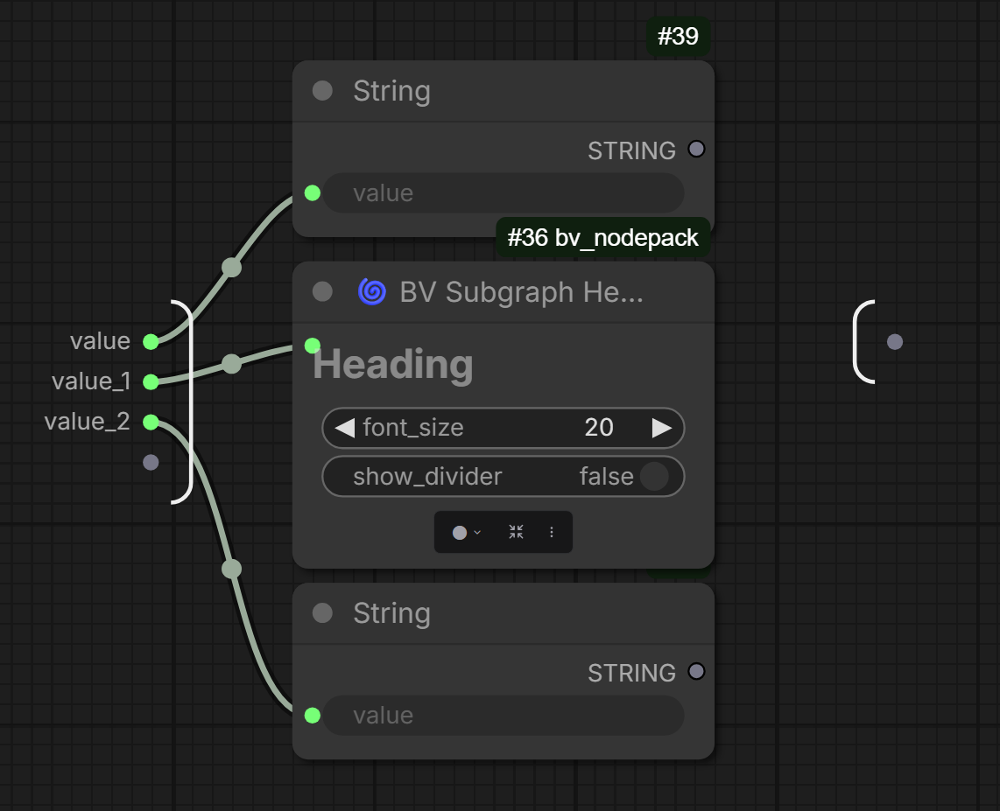


**Change Header text**

Click on the header to change the text.

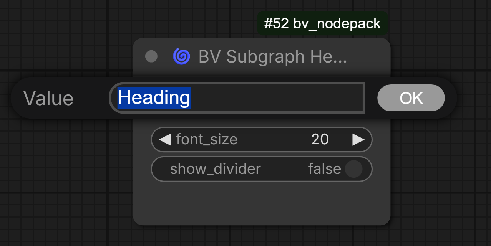

**Inputs**
- `value` (STRING) — the header text
- `font_size` (INT) — font size used for rendering
- `show_divider` (BOOLEAN) — optional divider line below the heading

**What it does**
- Displays a clean header label for visual separation
- Dynamically adjusts its node height to avoid text overlap/clipping
- Optional divider line for stronger section separation

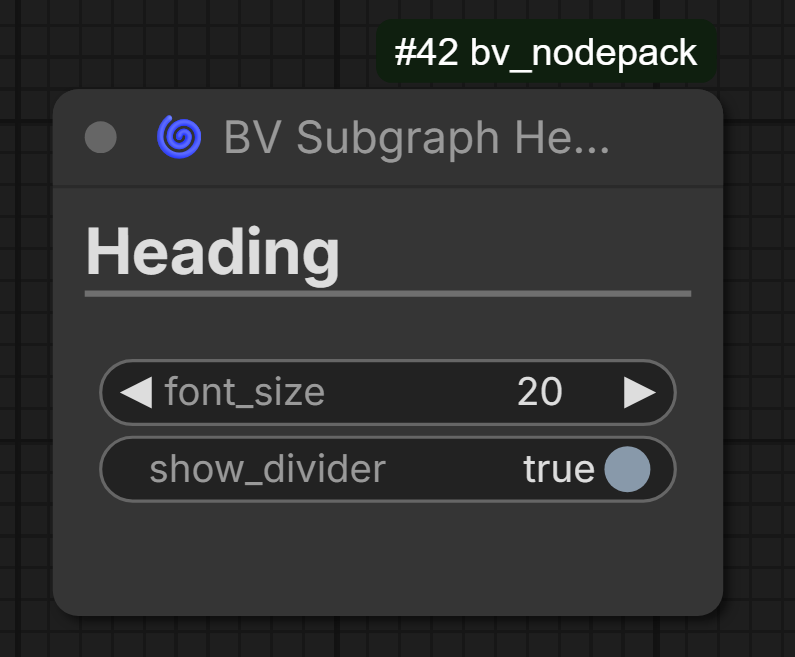

**How to use**
1. Add **BV Subgraph Heading**
2. Set the title via `value`
3. (Optional) increase `font_size`
4. (Optional) enable `show_divider`

**Subgraph usage**
- Place it inside a Subgraph/Subflow and expose the widget input to show the same heading on the Subgraph node.

---

### BV Spacer
A UI-only spacer node to add vertical whitespace in your graph or inside Subgraphs/Subflows.

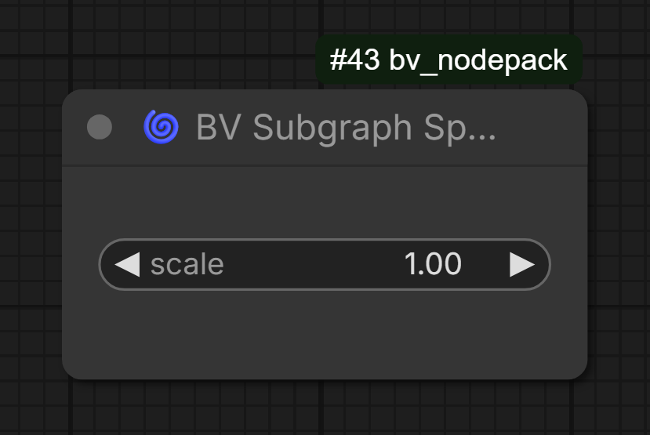

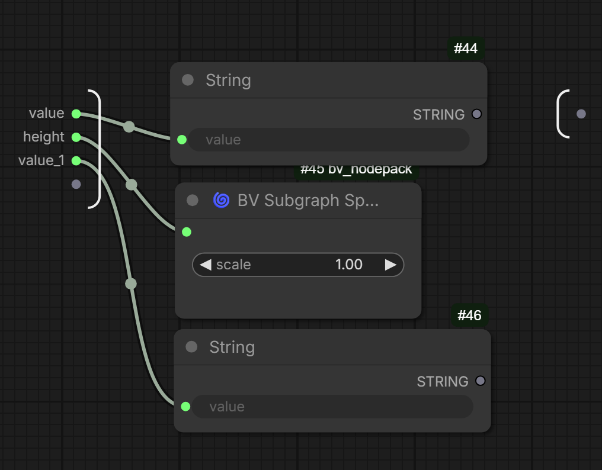

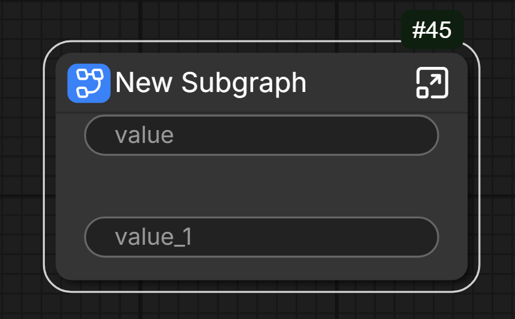

**Change Spacer height**

Click on the spacer to change the height.

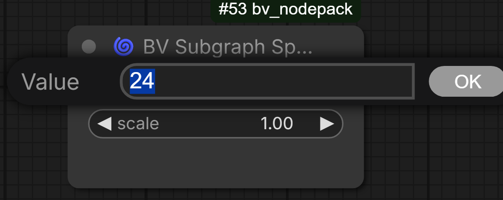

**Inputs**
- `height` (INT) — spacer height in pixels
- `scale` (FLOAT, optional) — multiplier for the height (useful for quick global spacing adjustments)

**What it does**
- Reserves vertical space without rendering text
- Updates its node height dynamically (also in Subgraphs/Subflows)

**How to use**
1. Add **BV Spacer**
2. Adjust `height` to the desired spacing
3. (Optional) use `scale` for fine-tuning

---

### BV Divider
A UI-only divider node that draws a horizontal line to visually separate sections.

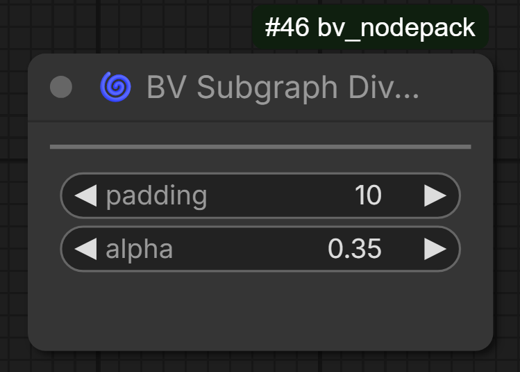

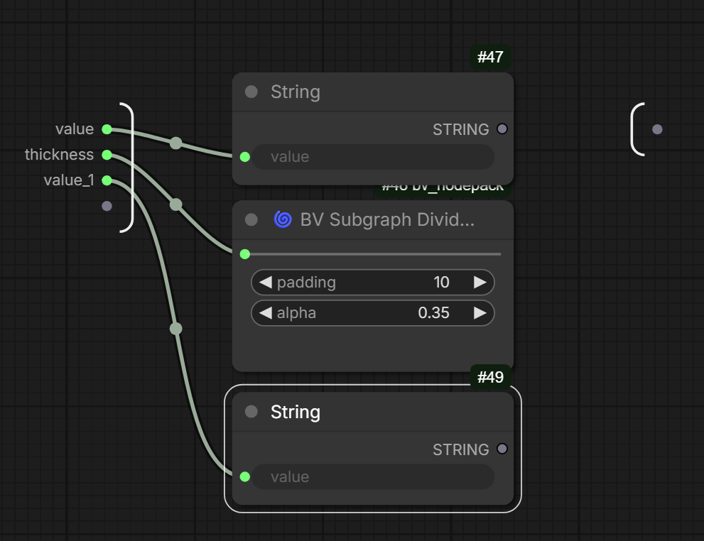

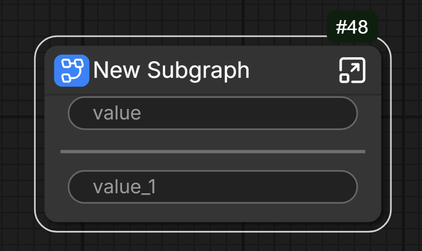

**Change Divide thickness**

Click on the divider to change the thickness.

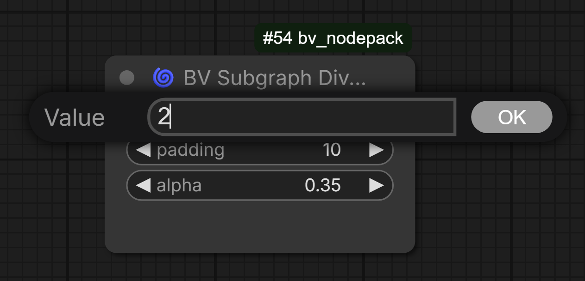

**Inputs**
- `thickness` (INT) — line thickness
- `padding` (INT) — left/right padding
- `alpha` (FLOAT) — line opacity

**What it does**
- Draws a horizontal separator line
- Dynamically updates when inputs change (also in Subgraphs/Subflows)

**How to use**
1. Add **BV Divider**
2. Adjust `thickness`, `padding`, and `alpha` to match your layout

---


## Quick Start (Pipe)

1. Add **BV Pipe Config** and enter names, e.g.:

```txt
model
clip
vae
seed
prompt
```

2. Connect: `BV Pipe Config (pipe)` → `BV Pipe (pipe)`

3. Optional: connect something to a slot input to override only that slot.

---

## Notes
- Pipes update dynamically (including Subgraphs/Subflows).
- Slot socket IDs stay stable internally (`v_001…v_100`, `out_001…out_100`) while labels come from your config.
- UI nodes (**Heading / Spacer / Divider**) use JavaScript rendering and support being exposed through Subgraphs/Subflows.

---

# Beta Nodes

## BV Control Center

The `BV Control Center` node is used to manage and control groups of nodes at runtime.
It allows you to assign a **mute** or **bypass** state to multiple graph groups and toggle these states dynamically.

Groups are defined and bundled via a separate configuration dialog.
Each configured group is exposed as a boolean control on the `BV Control Center` node, allowing centralized control of complex graph setups.

The `BV Control Center` fully supports **subgraphs**.
Its boolean control inputs can be exposed through a subgraph interface, enabling group states to be controlled from outside the subgraph without breaking encapsulation.

**Configuration**

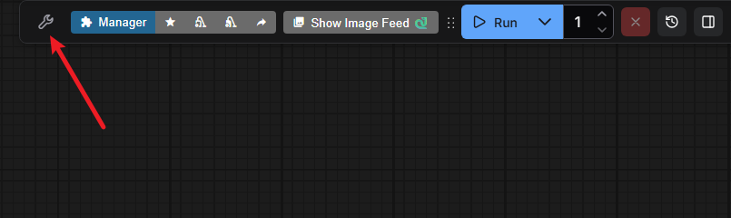

**UI**

Select group:

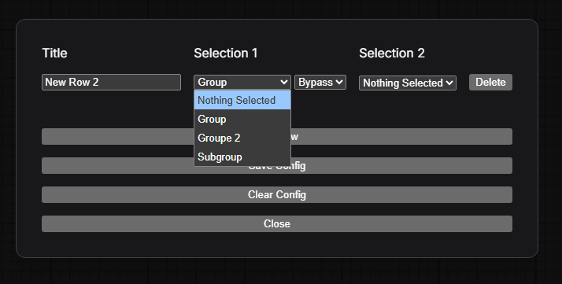

Define status:


Columns are automatically expanded:

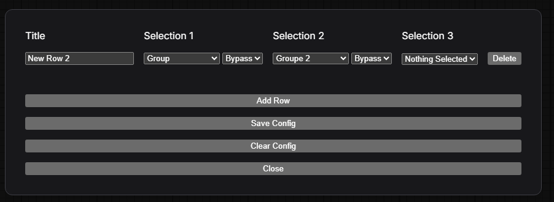

After saving the configuration, the `BV Control Center` Node updates itself.


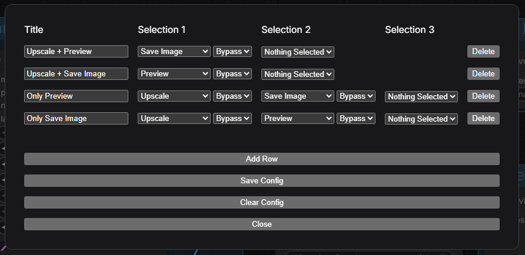


Here is an example if, for example, Only Preview is active


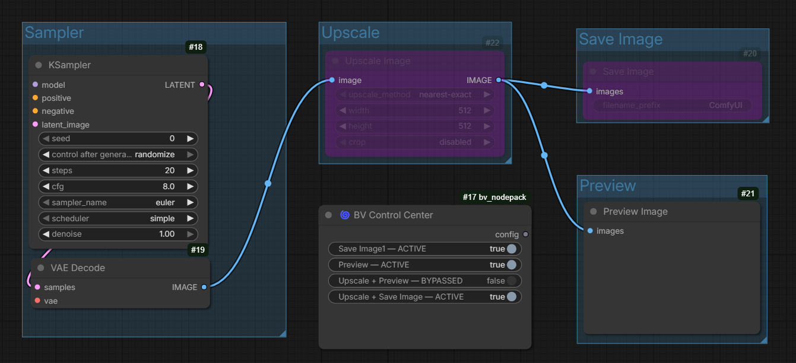

# This node and UI is still in BETA! State changes via exposed inputs from a subgraph do not update the state label due to event handling issues. #


### CHANGE LOG
* 2025-12-29 - v0.0.9: Fix of two subgraph issues wit the `BV Control Center`.
* 2025-12-29 - v0.0.8: Reworked the Code of `BV Control Center` node to make the Node more stable an change to TypeScript Code.


