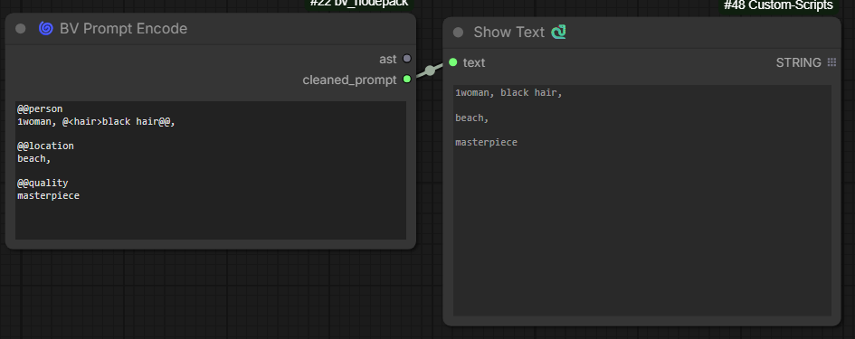
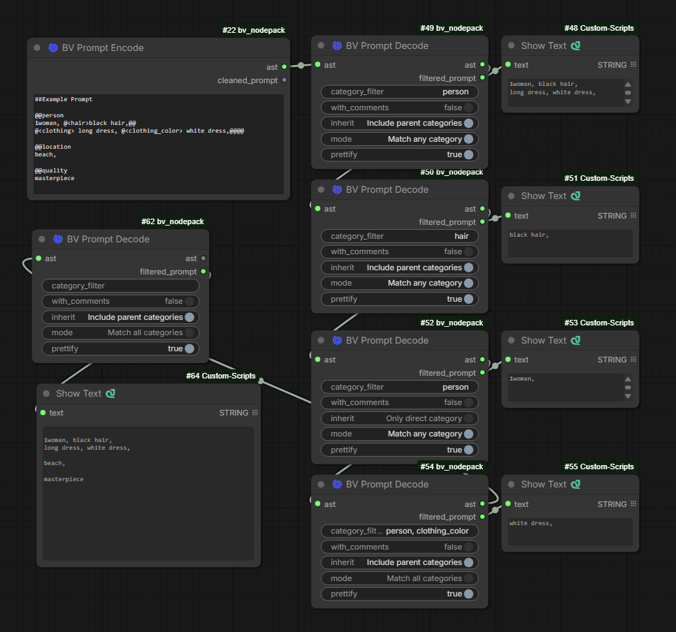
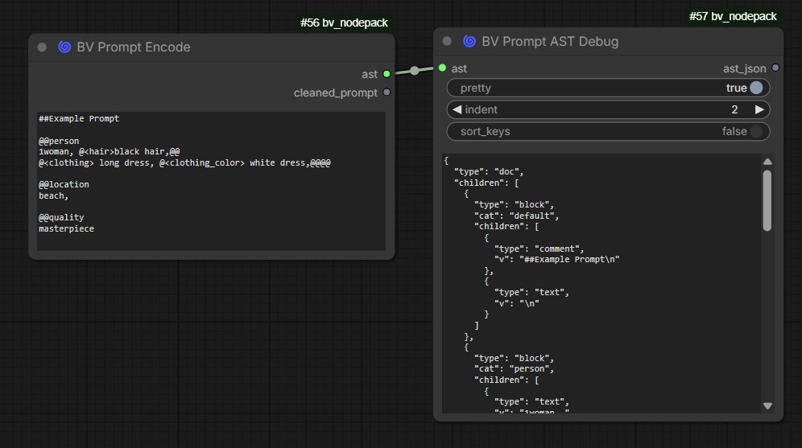
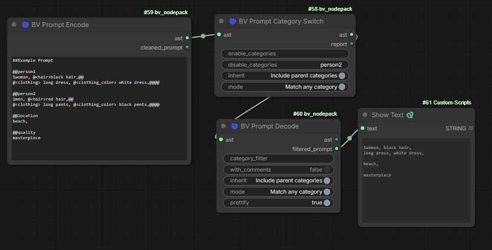
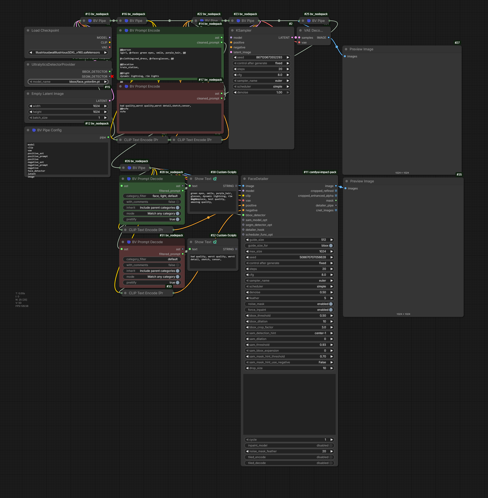

# BV Node Pack (ComfyUI)

A curated collection of **quality-of-life**, **UI**, and **prompting** nodes for **ComfyUI**, with a strong focus on:

- clean graph layouts
- Subgraph/Subflow compatibility
- metadata-driven pipelines
- AST-based prompt tooling (no fragile string parsing)

> ⚠️ **Important**
> This pack includes **JavaScript UI extensions** for dynamic node behavior.
> These extensions fully support **Subgraphs / Subflows**.

---

## 📌 Table of Contents

- [Installation](#installation)
- [Update & Uninstall](#update--uninstall)
- [Node Overview](#node-overview)
    - [Pipe Nodes](#pipe-nodes)
    - [UI / Layout Nodes](#ui--layout-nodes)
    - [Prompt / AST Nodes](#prompt--ast-nodes)
    - [Beta Nodes](#beta-nodes)
- [Prompt AST Syntax & Markup Guide](#prompt-ast-syntax--markup-guide)
- [Example application for AST](#example-application-for-ast)
- [Quick Start (BV Pipe)](#quick-start-bv-pipe)
- [Notes & Design Principles](#notes--design-principles)
- [Changelog](#changelog)

---

## Installation

Clone into your ComfyUI `custom_nodes` folder:

```bash
cd ComfyUI/custom_nodes
git clone https://github.com/BlackVortexAI/bv_nodepack.git
```

Restart ComfyUI and hard-refresh the browser:

**Ctrl + F5**

---

## Update & Uninstall

### Update

```bash
cd ComfyUI/custom_nodes/bv_nodepack
git pull
```

Restart ComfyUI (recommended).

### Uninstall

1. Delete the folder in `custom_nodes`
2. Restart ComfyUI
3. Hard refresh the browser (**Ctrl + F5**)

---

## Node Overview

Nodes are grouped by **functional category**.
Each section below can be read independently.

---

## Pipe Nodes

<details>
<summary><strong>BV Pipe Config</strong></summary>

Defines the slot layout (names) for a BV Pipe.

**Screenshot**
> Shows the BV Pipe Config node with a multiline list of slot names.
>
> 

**What it does**
- Define slot names (1 per line, max 100)
- Outputs a single `BV_PIPE` object (the "pipe")

**How to use**
1. Add **BV Pipe Config**
2. Enter slot names (one per line)
3. Connect its `pipe` output to **BV Pipe**

</details>

<details>
<summary><strong>BV Pipe</strong></summary>

A config-driven carrier node that forwards one pipe connection while exposing named slots.

**Screenshots**
> Connected state (slots visible)
>
> 

> Slot override example
>
> 

> Subgraph usage
>
> 

**What it does**
- Shows only the slots defined by the connected **BV Pipe Config**
- Allows overriding individual slots
- Passes through all untouched slots

</details>

---

## UI / Layout Nodes

<details>
<summary><strong>BV Subgraph Heading</strong></summary>

A UI node that renders a bold header text inside the node.

Designed specifically for **Subgraphs/Subflows**:
When exposed, the heading is also rendered on the Subgraph node itself.

**Screenshots**
> Heading inside normal graph
>
> 

> Heading inside Subgraph
>
> 

> Heading rendered on Subgraph node
>
> 

> Editing the heading text (click on header text to edit)
>
> 

**Inputs**
- `value` (STRING) — header text
- `font_size` (INT) — font size
- `show_divider` (BOOLEAN) — optional divider

</details>

<details>
<summary><strong>BV Spacer</strong></summary>

A UI-only spacer node used to add vertical whitespace.

**Screenshots**
> Normal graph
>
> 

> Inside Subgraph
>
> 

> Subgraph node view
>
> 

> Editing the spacer height (click on spacer to edit)
>
> 

**Inputs**
- `height` (INT) — spacer height in pixels
- `scale` (FLOAT, optional) — multiplier

</details>

<details>
<summary><strong>BV Divider</strong></summary>

A UI-only divider node that draws a horizontal separator line.

**Screenshots**
> Divider in graph
>
> 

> Divider inside Subgraph
>
> 

> Divider rendered on Subgraph node
>
> 

**Inputs**
- `thickness` (INT)
- `padding` (INT)
- `alpha` (FLOAT)

</details>

---

## Prompt / AST Nodes

> These nodes operate on a **structured AST (Abstract Syntax Tree)**, not on raw strings.
> This allows safe filtering, switching, inspection, and refactoring of prompts.

<details>
<summary><strong>BV Prompt Encode</strong></summary>

**Purpose**
- Parses a tagged prompt into an AST

**Input**
- `prompt` (STRING, multiline)

**Output**
- `ast` (`BV_AST`)
- `cleaned_prompt` (plain text, no markup, no comments)

**Screenshot**
> Example output
>
> 

</details>

<details>
<summary><strong>BV Prompt Decode</strong></summary>

**Purpose**
- Extracts plain text from the AST by category

**Key Features**
- Multi-category filtering
- `any` / `all` matching
- Inheritance (parent categories)
- Optional prettify pass
- If no filter is set, all categories are displayed.

**Screenshot**
> Example output
>
> 

</details>

<details>
<summary><strong>BV Prompt AST Debug</strong></summary>

**Purpose**
- Visual inspection of the AST

**Features**
- JSON pretty-print
- Readonly, scrollable output field
- Safe for large ASTs

**Screenshot**
> Example output
>
> 

</details>

<details>
<summary><strong>BV Prompt Category Switch</strong></summary>

**Purpose**
- Enable / disable categories directly on the AST
- No string parsing

**Features**
- Enable categories
- Disable categories (wins over enable)
- `inherit` and `any/all` matching

**Screenshot**
> Example output
>
> 

</details>

---

## Prompt AST Syntax & Markup Guide

This section explains the **exact prompt syntax** that is parsed into the AST.

### Default (no markup)
```text
A beautiful landscape, sunset lighting
```

### Block categories
```text
@@style
cinematic lighting
@@subject
a woman in rain
```

### Inline categories
```text
a portrait with @<eye> green eyes @@ and @<hair> black hair @@
```

### Nested inline categories
```text
@<subject> a @<face> smiling woman @@ in rain @@
```

### Comments
```text
a portrait ## this is a comment
```

### ⚠️ Common Syntax Pitfalls (Important)

Category names must not contain spaces.

Inline categories are only recognized if the category name matches this pattern:

>[a-zA-Z0-9_-]+


#### ❌ Invalid
```text
@<clothing color> white dress @@
```

✅ Valid
```text
@<clothing_color> white dress @@
```
### Closing inline categories (@@)
```text
@@ closes one currently open inline category

Extra @@ without an open category are treated as literal text and will appear in the output
```
### ❌ Invalid (too many closings)
```text
@<clothing> long dress,@@@@
```

✅ Valid
```text
@<clothing> long dress,@@
```

## Example application for AST

---

## Beta Nodes

<details>
<summary><strong>BV Control Center</strong> ⚠️ BETA</summary>

Centralized runtime control for **mute / bypass** states of node groups.

**Key Features**
- Group-based control
- Subgraph-compatible
- Dynamic UI reconfiguration

**Screenshot**
> Configuration
>
> 

> Selected group
>
> 

> Define status
>
> 

>Columns are automatically expanded
>
>

>After saving the configuration, the `BV Control Center` Node updates itself.
>
>
>

>Here is an example if, for example, Only Preview is active
>
> 
</details>

---

## Quick Start (BV Pipe)

1. Add **BV Pipe Config** and enter slot names:

```txt
model
clip
vae
seed
prompt
```

2. Connect:

`BV Pipe Config (pipe)` → `BV Pipe (pipe)`

3. Optionally override individual slots.

---

## Notes & Design Principles

- Slot IDs are stable internally (`v_001…v_100`)
- Labels are user-defined and dynamic
- UI nodes are rendered via JavaScript
- All UI nodes support Subgraphs / Subflows
- Prompt nodes operate on **AST**, not raw strings

---

## Changelog

### 2026-01-02
- v0.0.19 — Update README: add AST example image with embedded workflow
- v0.0.18 — Add AST Prompting system
- v0.0.17 — Changed toggle label system (`BV Control Center`)
- v0.0.16 — Renamed inputs to avoid collisions

### 2026-01-01
- v0.0.15 — Fix subgraph renaming bug
- v0.0.14 — Widget fixes for subgraph usage

### 2025-12-31
- v0.0.13 — Fix label inversion error
- v0.0.12 — Fix input error
- v0.0.11 — Reworked renaming logic

### 2025-12-30
- v0.0.10 — Fix widget create event

### 2025-12-29
- v0.0.9 — Fix subgraph issues
- v0.0.8 — Major refactor to TypeScript

