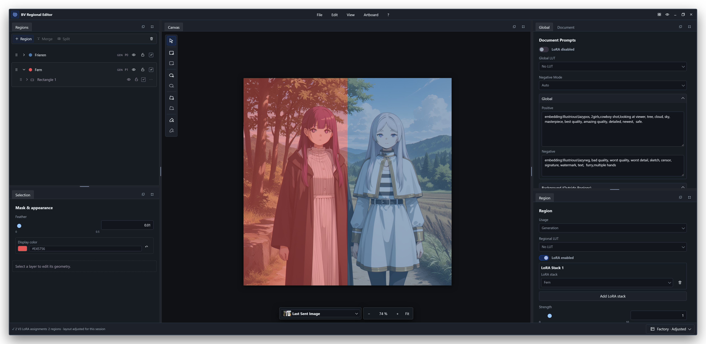
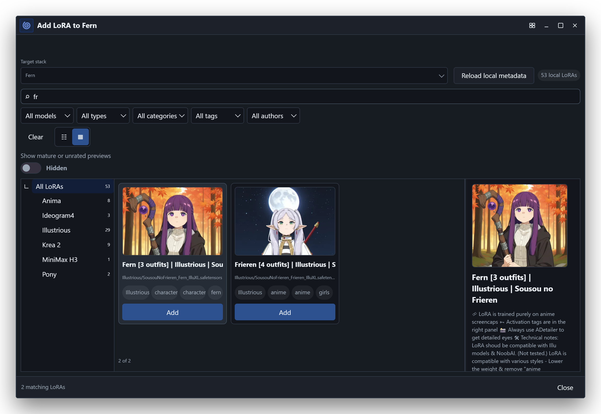
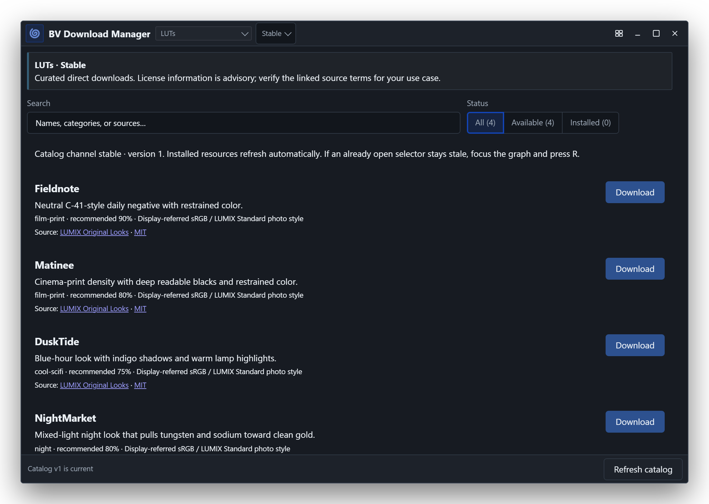
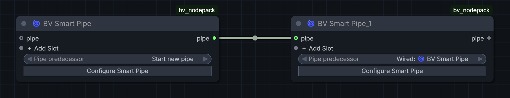
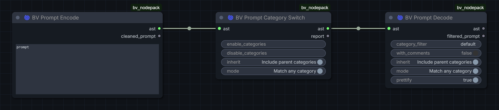

# BV Node Pack for ComfyUI


BV Node Pack adds visual regional prompting, model-specific regional attention,
regional LoRA routing, sequential detailer workflows, Smart Pipes, structured prompt
tools, Subgraph controls and deterministic workflow utilities to ComfyUI.

> [!NOTE]
> BV Node Pack is developed with extensive generative-AI assistance. Product
> direction, architecture, review and real-workflow validation remain human-led.

> [!IMPORTANT]
> **BV Node Pack 1.3.0** adds unified Regional negative-prompt policies, local embedding
> completion, catalog and UI improvements, and Subgraph-aware routing.
> The [Wiki](https://blackvortexai.github.io/bv_nodepack_wiki/) contains the full
> node reference and task-oriented guides.
>
> Existing Regional workflows retain compatibility and supported node-local data is
> migrated when a workflow is loaded. Loading does not overwrite the workflow file,
> and deprecated Regional wiring is not silently rebuilt. Keep a backup, migrate any
> remaining legacy connections to the V3 resource flow, then save, reload and run the
> updated workflow once. Press **Ctrl+Alt+B** to toggle **Regional Legacy Debug Mode**
> when hidden legacy ports or V3 provider links are needed for inspection. The
> shortcut can be changed in ComfyUI Settings → Shortcuts.

## Installation

Install **BV Node Pack** through ComfyUI Manager, or clone it into
`ComfyUI/custom_nodes`:

```bash
git clone https://github.com/BlackVortexAI/bv_nodepack.git
```

Restart ComfyUI and hard-refresh the browser after installation or update.

Registry review remains open in [issue #217](https://github.com/Comfy-Org/registry-backend/issues/217).
Registry publication, security-review status and the version offered by Manager are
separate states; Manager may offer an older version while review is pending.

### Updating to 1.3.0

- Re-enter existing API keys for custom OpenAI-compatible providers through
  **Configure API Key** and confirm the displayed destination. Keys are bound to
  that full endpoint; redirects are blocked. Fixed-provider legacy keys retain
  their catalog destination.
- Regional LoRA stacks accept files only inside configured ComfyUI LoRA folders,
  including `extra_model_paths.yaml` entries. Register additional folders there;
  absolute paths within configured folders remain supported.
- Text logs reject linked log files and linked `bv_logs` directories. Use an
  ordinary log directory below the configured ComfyUI output root.

Keep ComfyUI and its settings routes restricted to trusted users, and review
imported workflows before running them. These safeguards do not constitute
Registry approval or a guarantee that arbitrary workflows are safe.

## Feature overview

### Regional prompting and LoRA routing



Create named regions with layered geometry, prompts and stable identities, then
compile them through native conditioning or supported model-specific attention
backends. Regional V3 supports independently resolved workflow-local LoRA resources.

[Read the Regional V3 guide →](https://blackvortexai.github.io/bv_nodepack_wiki/node-guides/regional-v3)

### LUT and LoRA libraries



<details>
<summary>View the LUT catalog</summary>



</details>

Configure workflow-local LUT and LoRA resources through the shared BV interfaces.
The LUT catalog has separate Stable and Experimental channels, retains a local
working copy for offline startup, refreshes asynchronously and verifies downloads
against pinned checksums. Built-in LUTs and files below `ComfyUI/models/luts` use
the same loader and registry path.

[Read the LUT library guide →](https://blackvortexai.github.io/bv_nodepack_wiki/node-guides/lut-library)

[Read the LoRA library guide →](https://blackvortexai.github.io/bv_nodepack_wiki/node-guides/lora-library)

### Smart Pipes



*Reviewed native wiring diagram; not an executed workflow.*

Carry typed workflow state through wired or wireless branches while preserving stable
slot identity.

[Read the Smart Pipes guide →](https://blackvortexai.github.io/bv_nodepack_wiki/node-guides/smart-pipes)

### Workflow Control

Switch named workflow stages deterministically between active, muted and bypassed
states.

[Read the Workflow Control guide →](https://blackvortexai.github.io/bv_nodepack_wiki/node-guides/workflow-control)

### Structured prompts



*Reviewed native wiring diagram; not an executed workflow.*

Encode, filter, route and decode semantic prompt blocks without fragile string
replacement.

[Read the Structured Prompt guide →](https://blackvortexai.github.io/bv_nodepack_wiki/node-guides/prompt-processing)

### Subgraph interface tools

Project headings, dividers, spacers and controlled choices onto purpose-built
Subgraphs.

[Read the Subgraph Interface guide →](https://blackvortexai.github.io/bv_nodepack_wiki/node-guides/subgraph-interface)

### Latent utilities

Create deterministic latent sizes and transformations for reusable workflows.

[Read the Latent Utilities guide →](https://blackvortexai.github.io/bv_nodepack_wiki/node-guides/latent-utilities)

## Documentation and workflows

Detailed guides and references are maintained separately from the runtime repository
in the [BV Node Pack Wiki](https://blackvortexai.github.io/bv_nodepack_wiki/).

Only selected, verified examples are published in [`workflows`](workflows/README.md).

## Support

Report reproducible bugs and feature requests through
[GitHub Issues](https://github.com/BlackVortexAI/bv_nodepack/issues).

## License and notices

BV Node Pack is licensed under [GPL-3.0](LICENSE). Third-party attribution and
provenance are listed in [THIRD_PARTY_NOTICES.md](THIRD_PARTY_NOTICES.md).

## Changelog

The README keeps the four most recent version entries. The complete history is
maintained in the [Wiki changelog](https://blackvortexai.github.io/bv_nodepack_wiki/reference/changelog).

### 1.3.0 — 2026-09-05

- Unify Regional negative-prompt policies (`auto`, `prompt`, `zero_out`) across
  Anima, FLUX.2, Krea 2 and Z-Image, with scoped Anima negatives and CFG token masking.
- Add local `embedding:` completion to shared prompt editors.
- Improve LoRA catalog refresh, preview sidecar discovery and persistent preview
  preferences; previews remain opt-in.
- Improve shared resizable previews, window text selection and GraphImage DOM capture.
- Add the built-in **Day for Night** LUT and image sender preview/pass-through
  behavior when no target is selected.
- Improve Civitai seed and LoRA hash metadata, and workflow-scoped DG routing
  through Subgraphs for registries and Smart Pipes.
- Refresh documentation with all 62 public-node screenshots and reviewed native
  wiring diagrams. Wiring captures do not establish successful workflow execution.
- Bind remote API keys to approved endpoints, block redirects, and harden text-log
  aliases and Regional LoRA path boundaries.
- Update the frontend build toolchain; the release audit reports no known npm
  advisories at the time of validation.

### 1.2.3 — 2026-09-01

- Harden the Comfy Registry package by excluding development tests and UI source
  files while retaining the committed runtime bundle. Runtime behavior is unchanged.

### 1.2.2 — 2026-08-31

- Centralize native node, port and widget presentation across Classic and Nodes
  2.0, including titlebar routing for hidden infrastructure connections.
- Add Regional Canvas image selection from connected inputs and sender sources,
  including a compact thumbnail picker and automatic latest-image selection.
- Align LoRA Registry count and summary outputs and use stable 0.05 increments
  for strength scrubbing.
- Remove the temporary titlebar-port Canary after the shared production path
  passed the complete regression suite.

### 1.2.1 — 2026-08-30

- Add `BV Inspect Any` for readable in-node previews and string pass-through of
  arbitrary values.
- Make BV node widgets follow the active ComfyUI light or dark theme through the
  shared widget UI layer.
- Extend `BV Regional Image Save` with an optional Regional Context input and
  Civitai-compatible prompt, sampler, model, LoRA and hash metadata while
  preserving existing workflows when the input is disconnected.
