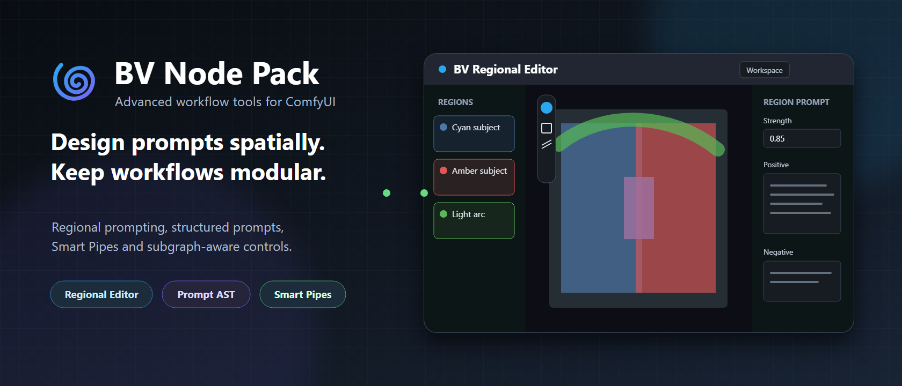
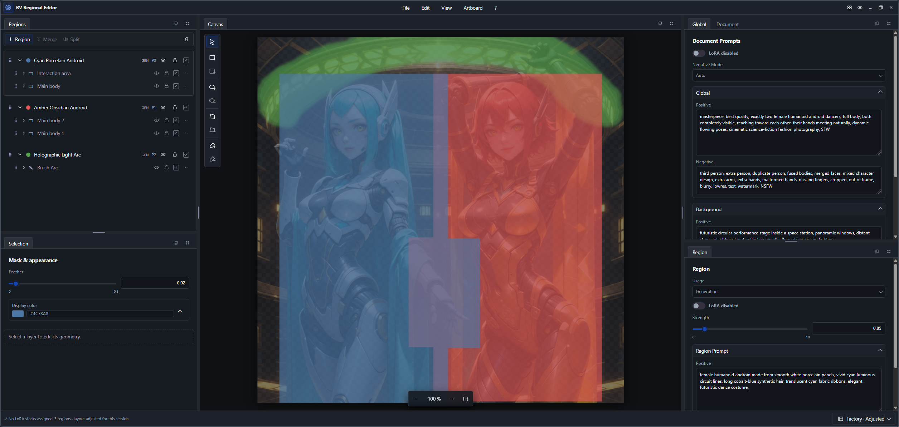

# BV Node Pack for ComfyUI



BV Node Pack adds visual regional prompting, model-specific regional attention,
regional LoRA routing, sequential detailer workflows, Smart Pipes, structured prompt
tools, Subgraph controls and deterministic workflow utilities to ComfyUI.

> [!NOTE]
> BV Node Pack is developed with extensive generative-AI assistance. Product
> direction, architecture, review and real-workflow validation remain human-led.

> [!IMPORTANT]
> **BV Node Pack 1.0.0 introduces Regional V3.** The accompanying
> [Wiki](https://blackvortexai.github.io/bv_nodepack_wiki/) is online but still
> under construction, so missing screenshots or incomplete pages do not indicate
> missing runtime features.
>
> Existing Regional workflows retain compatibility and supported node-local data is
> migrated when a workflow is loaded. Loading does not overwrite the workflow file,
> and deprecated Regional wiring is not silently rebuilt. Keep a backup, migrate any
> remaining legacy connections to the V3 resource flow, then save, reload and run the
> updated workflow once. Press **Ctrl+Alt+B** to toggle **Regional Legacy Debug Mode**
> when hidden legacy ports or V3 provider links are needed for inspection. The
> shortcut can be changed in ComfyUI Settings → Shortcuts.

## Installation

Install **BV Node Pack** through ComfyUI Manager, or clone it into
`ComfyUI/custom_nodes`:

```bash
git clone https://github.com/BlackVortexAI/bv_nodepack.git
```

Restart ComfyUI and hard-refresh the browser after installation or update.

## Feature overview

### Regional prompting and LoRA routing



Create named regions with layered geometry, prompts and stable identities, then
compile them through native conditioning or supported model-specific attention
backends. Regional V3 supports independently resolved workflow-local LoRA resources.

[Read the Regional V3 guide →](https://blackvortexai.github.io/bv_nodepack_wiki/node-guides/regional-v3)

### Smart Pipes


Carry typed workflow state through wired or wireless branches while preserving stable
slot identity.

[Read the Smart Pipes guide →](https://blackvortexai.github.io/bv_nodepack_wiki/node-guides/smart-pipes)

### Workflow Control


Switch named workflow stages deterministically between active, muted and bypassed
states.

[Read the Workflow Control guide →](https://blackvortexai.github.io/bv_nodepack_wiki/node-guides/workflow-control)

### Structured prompts


Encode, filter, route and decode semantic prompt blocks without fragile string
replacement.

[Read the Structured Prompt guide →](https://blackvortexai.github.io/bv_nodepack_wiki/node-guides/prompt-processing)

### Subgraph interface tools


Project headings, dividers, spacers and controlled choices onto purpose-built
Subgraphs.

[Read the Subgraph Interface guide →](https://blackvortexai.github.io/bv_nodepack_wiki/node-guides/subgraph-interface)

### Latent utilities


Create deterministic latent sizes and transformations for reusable workflows.

[Read the Latent Utilities guide →](https://blackvortexai.github.io/bv_nodepack_wiki/node-guides/latent-utilities)

## Documentation and workflows

Detailed guides and references are maintained separately from the runtime repository
in the [BV Node Pack Wiki](https://blackvortexai.github.io/bv_nodepack_wiki/).

Only selected, verified examples are published in [`workflows`](workflows/README.md).

## Support

Report reproducible bugs and feature requests through
[GitHub Issues](https://github.com/BlackVortexAI/bv_nodepack/issues).

## License and notices

BV Node Pack is licensed under [GPL-3.0](LICENSE). Third-party attribution and
provenance are listed in [THIRD_PARTY_NOTICES.md](THIRD_PARTY_NOTICES.md).
