# BV Node Pack for ComfyUI

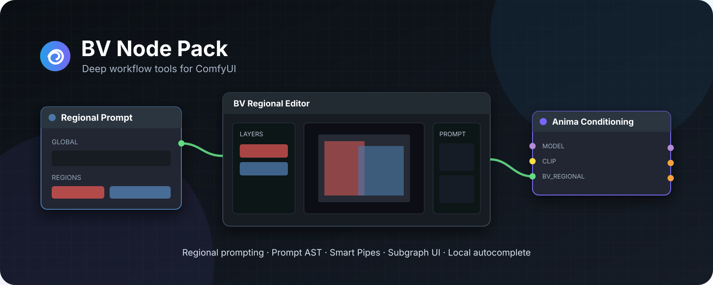

BV Node Pack is a collection of deep workflow tools for **regional prompting**,
**structured prompts**, **Smart Pipes**, **Subgraph interfaces**, reusable graph
controls and deterministic latent utilities.

The pack targets current ComfyUI workflows and treats stable data contracts,
Subgraph behavior and graceful failure as first-class features.

> BV Node Pack includes frontend extensions. Restart ComfyUI and hard-refresh the
> browser after installing or updating so Python nodes and JavaScript stay in sync.

## Highlights

| Feature | What it solves |
| --- | --- |
| [Regional Editor](#regional-prompting) | Author any number of named, overlapping rectangle and brush regions in a floating or workspace editor |
| [Prompt Autocomplete](#prompt-autocomplete) | Local, optional CSV/TSV completion in BV editors and ordinary ComfyUI multiline fields |
| [Prompt AST](#structured-prompt-ast) | Filter and reuse semantic prompt blocks without fragile string replacement |
| [Smart Pipe](#smart-pipes) | Grow typed workflow state through wired or wireless branches while retaining stable slot identity |
| [Subgraph UI](#subgraph-interface-nodes) | Project headings, dividers, spacers and controlled choices onto purpose-built Subgraphs |
| [Control Center](#workflow-control) | Switch named graph stages between activate, mute and bypass with deterministic conflict handling |

## Installation

### ComfyUI Manager

Search for **BV Node Pack** in the Custom Nodes Manager / Extensions view and install it.

### Git

```bash
cd ComfyUI/custom_nodes
git clone https://github.com/BlackVortexAI/bv_nodepack.git
```

Restart ComfyUI, then hard-refresh the browser with **Ctrl + F5**.

### Update

```bash
cd ComfyUI/custom_nodes/bv_nodepack
git pull
```

Restart ComfyUI after updates. To uninstall, remove the `bv_nodepack` directory,
restart ComfyUI and hard-refresh the browser.

## Regional prompting

The model-neutral `BV_REGIONAL` document separates authoring from execution. The
editor stores prompts, geometry and stable identities; compiler nodes translate
that document for a particular model/backend.

[](examples/images/anima-android-dance-regional-showcase.png)

This Anima example uses two independently conditioned androids, small overlapping
interaction rectangles around their hands and a painted light-arc region. The
character prompts do not encode left/right placement; the regional document supplies
the spatial guidance.

[Download the workflow PNG](examples/images/anima-android-dance-regional-showcase.png)
· [Download the regional document](docs/examples/anima-android-dance-regional-showcase.bv-regional.json)

> [!IMPORTANT]
> Regional conditioning is spatial guidance, not a hard segmentation or layout
> constraint. A model can extend subjects beyond a region, move an interaction,
> blend attributes or ignore part of the requested composition. `joint` overlap
> lets overlapping pixels attend to multiple regional contexts; it does not force
> the depicted subjects to interact. Region strength changes conditioning influence,
> not boundary strictness.

### Core workflow

1. Add **BV Regional Prompt** and open it from the node or BV toolbar action.
2. Define Global and Background prompts.
3. Add regions, then draw rectangles or additive/subtractive brush layers.
4. Connect `regional` to a compiler:
   - **BV Regional Native Conditioning** for standard masked ComfyUI conditioning;
   - **BV Regional Anima Conditioning** for the built-in Anima attention backend.
5. Connect `patched_model`/`positive`/`negative` to a standard KSampler.
6. Optionally return the latest image through **Preview Send** or **Save Send**.

The editor supports overlap, priority ordering, undo/redo, layer controls, zoom,
pan, WYSIWYG aspect ratios, document import/export and persistent per-document UI state.

Read the illustrated **[Regional Editor Guide](docs/regional-editor-guide.md)** for
tools, prompts, model behavior, image feedback, document utilities and current limits.

<details>
<summary><strong>Open the editor and use Quick Edit</strong></summary>

The node exposes both entry points directly:

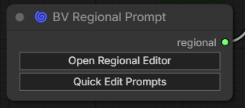

The same actions are available from the ComfyUI toolbar for the currently selected
regional document:

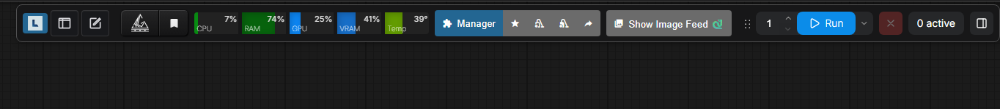

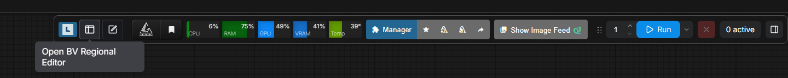

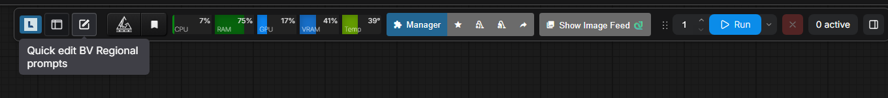

Quick Edit provides prompt-only access without opening the artboard:

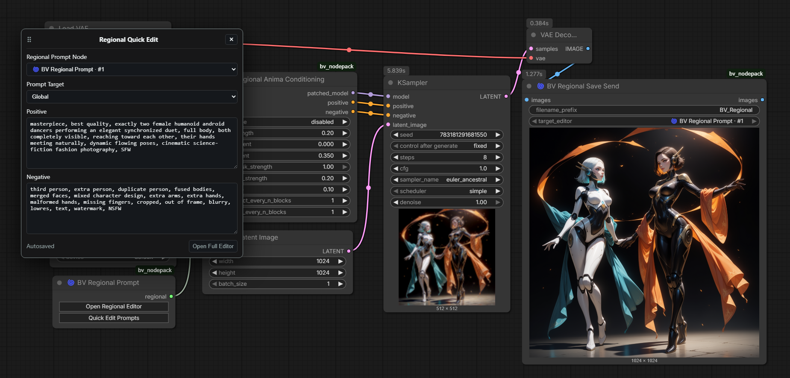

</details>

<details>
<summary><strong>Workspace, floating mode and display controls</strong></summary>

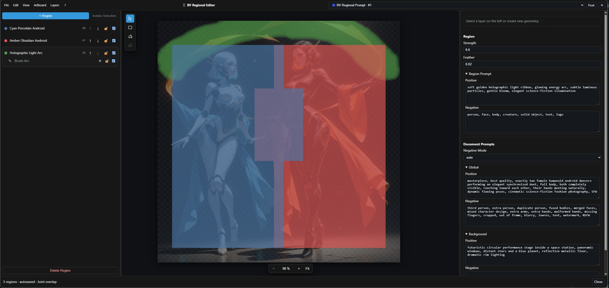


Mask visibility and background-image opacity are editor-only display settings:

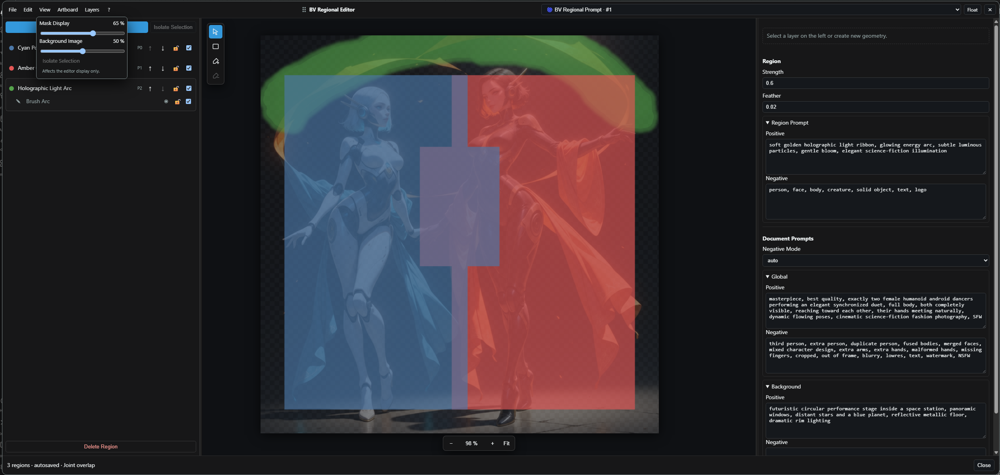

</details>

<details>
<summary><strong>Rectangles, interaction overlap and brush regions</strong></summary>

Each character uses a main rectangle plus an independently selectable interaction
rectangle. The brush region demonstrates a non-rectangular light arc.

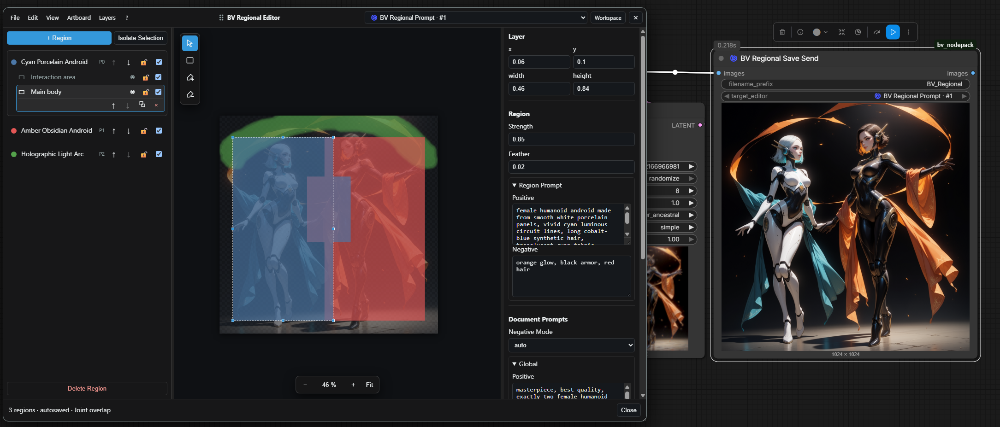

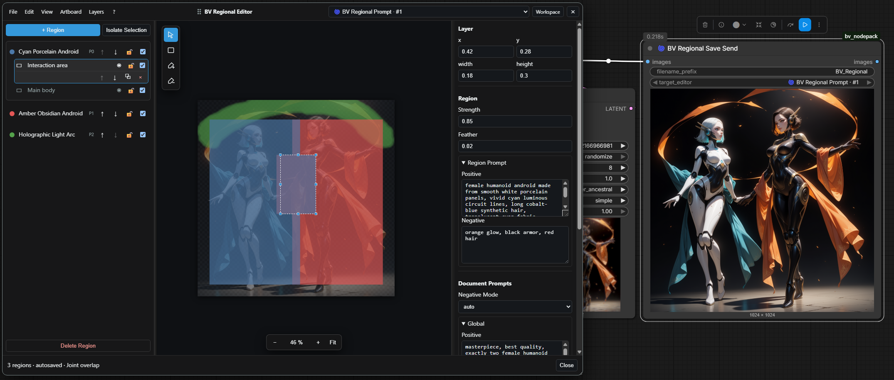

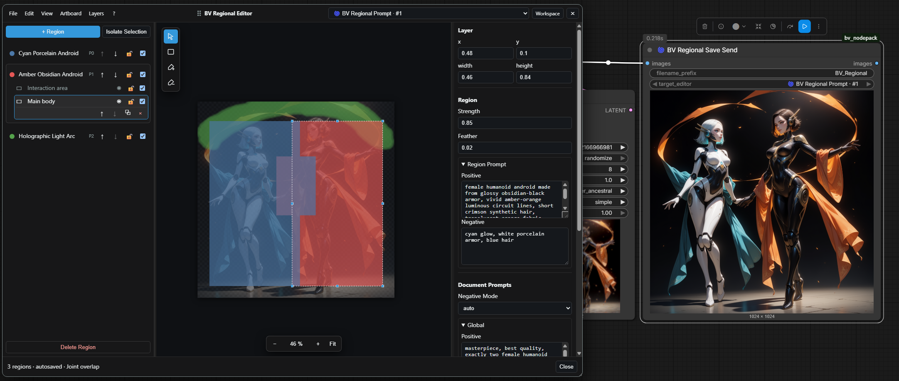

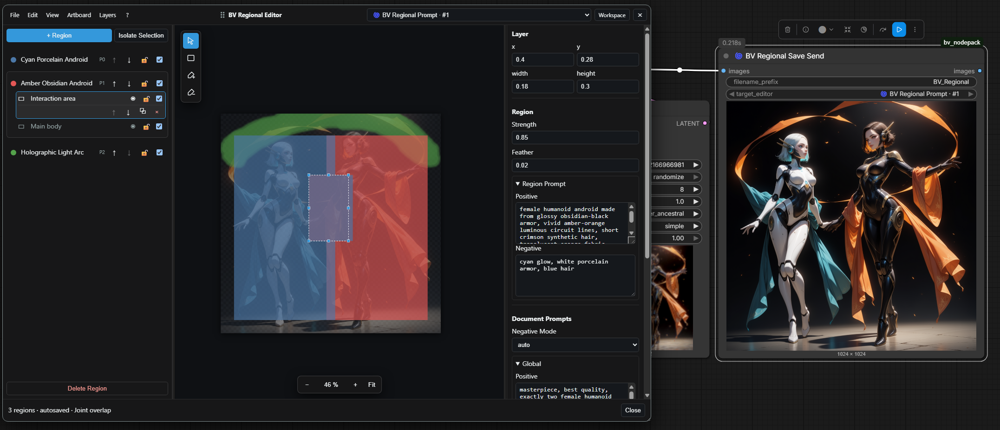

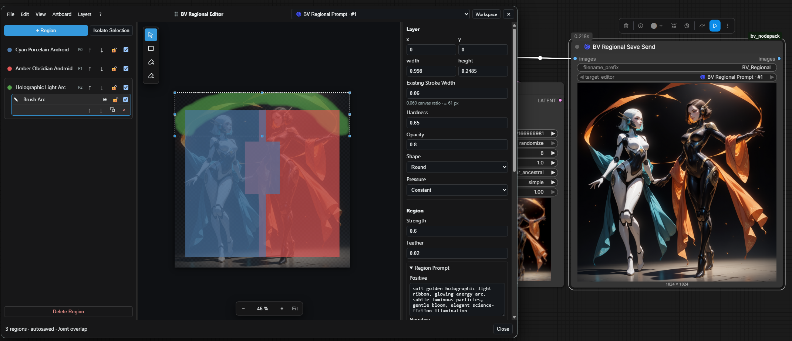

</details>

<details>
<summary><strong>Minimal Anima workflow</strong></summary>

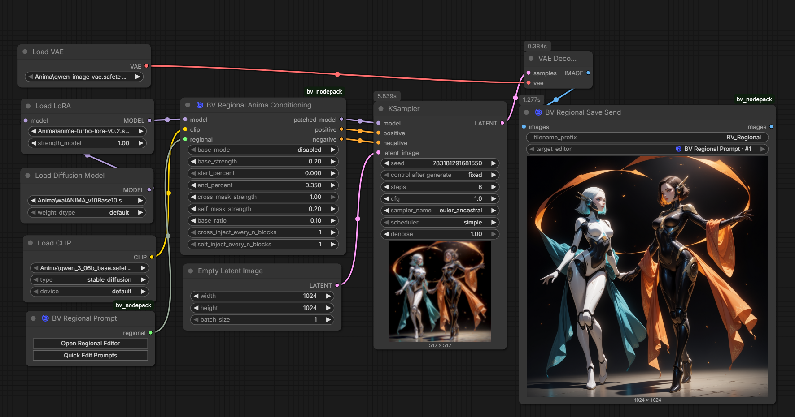

</details>

### Regional node family

| Node | Purpose |
| --- | --- |
| BV Regional Prompt | Owns and outputs the serialized `BV_REGIONAL` document |
| BV Regional Native Conditioning | Compiles Global, Background and region masks into standard conditioning |
| BV Regional Anima Conditioning | Applies the built-in Anima attention patch and emits KSampler-ready outputs |
| BV Regional Anima Adapter | Optional compatibility path for the external Anima regional node pack |
| BV Regional Preview Send | Sends a temporary image preview to a selected editor |
| BV Regional Save Send | Saves and sends the same image to a selected editor |
| BV Regional Debug | Shows canonical JSON, a summary and `document_id` |
| BV Regional Select | Selects Global, Background or one region |
| BV Regional Deconstructor | Exposes AST, text, source and reusable selection data |
| BV Regional Prompt Extract | Extracts positive/negative prompt representations |
| BV Regional Mask Render | Renders a selected mask and pixel bounding box |

## Prompt autocomplete

BV Prompt Autocomplete uses local datasets and does not require another completion
extension. The bundled `data/completion/bv_default_tags.csv` is active by default.

- Supports legacy four-column CSV and extensible header-based CSV/TSV files.
- Preserves descriptions, provenance, safety scores and unknown future metadata.
- Inserts tag names with spaces while retaining canonical underscore tags as metadata.
- Works in the Regional Editor, Quick Edit and ordinary ComfyUI multiline widgets.
- Can be disabled globally or inside the editor when another completer should own fields.
- Supports multiple ordered datasets; the topmost enabled source wins duplicate tags.

Custom widgets can opt out with `data-bv-autocomplete="off"` on the textarea or an ancestor.
An absolute dataset may be forced with the `BV_COMPLETION_DATASET` environment variable.

<details>
<summary><strong>Autocomplete in Quick Edit, the full editor and native multiline widgets</strong></summary>

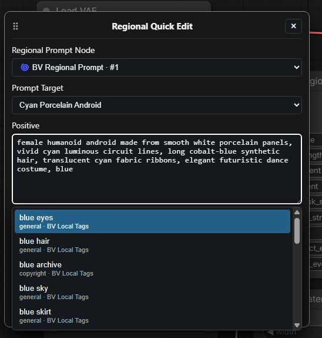

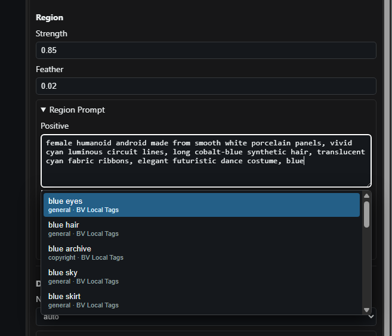

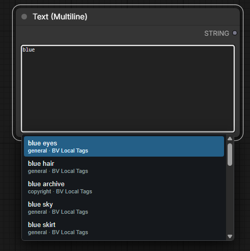

</details>

<details>
<summary><strong>Dataset selection, priority and global enable switch</strong></summary>

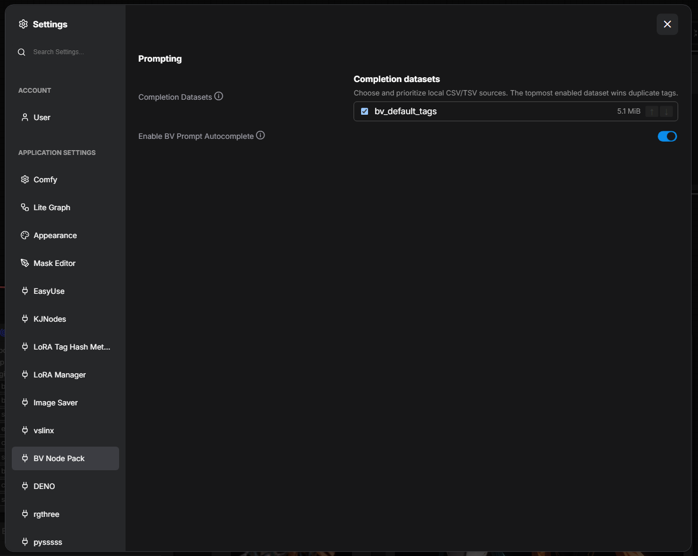

</details>

## Smart Pipes

**BV Smart Pipe** carries a chain-growing set of values identified by stable slot
IDs. Each node exposes only the inputs and outputs required at that point in the workflow.

### Incremental slot inheritance

Unlike fixed pipe systems, a Smart Pipe does not expose one global port list on
every node. Each node inherits the complete slot contract of its selected predecessor
and may append new slots locally. Those additions become available only from that
point downstream; they do not appear retroactively on earlier nodes or unrelated branches.

| Chain position | Visible contract |
| --- | --- |
| Loader pipe | Local `model`, `clip`, `vae` |
| Prompt pipe | Inherited `model`, `clip`, `vae` + local `positive`, `negative` |
| Sampling pipe | Everything inherited above + local `latent`, `seed` |

Inherited slots can be passed through unchanged or overridden at the current node.
Because every slot has a stable logical identity, downstream connections continue to
refer to the correct value even when labels change or an upstream slot is temporarily missing.

[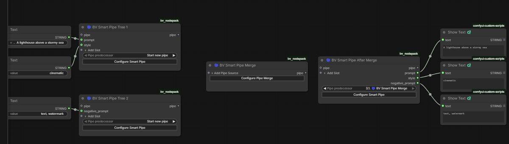](examples/images/smart-pipe-wireless-merge.png)

- Wired and wireless routing can be mixed.
- Each branch inherits only its own upstream slots and can grow independently.
- Bypassed nodes pass inherited state without applying local writes.
- Muted nodes stop only their dependent execution branch.
- Removed upstream slots remain identifiable instead of silently shifting connections.
- **BV Smart Pipe Merge** combines branches in explicit user-defined order.
- Missing sources and cycles fail closed.

Configure slots through **Configure Smart Pipe**. The legacy **BV Pipe Config** and
**BV Pipe** nodes remain available only for existing workflows.

> Wireless routing across Subgraph boundaries relies on prompt materialization because
> ComfyUI does not currently expose an official pre-prompt extension hook. Keep physical
> pipe links in compatibility-critical workflows.

## Structured Prompt AST

Prompt AST nodes preserve semantic categories instead of repeatedly parsing flattened text.

[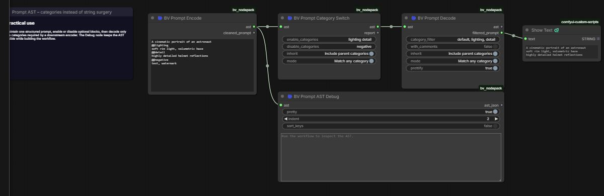](examples/images/prompt-ast-categories.png)

| Node | Purpose |
| --- | --- |
| BV Prompt Encode | Parses tagged source into `BV_AST` plus cleaned text |
| BV Prompt Category Switch | Enables/disables categories with inheritance and any/all matching |
| BV Prompt Decode | Materializes selected categories as plain text |
| BV Prompt AST Debug | Displays the current AST as formatted JSON |

See the **[Prompt AST syntax and markup guide](docs/prompt-ast-guide.md)**.

## Subgraph interface nodes

These nodes build readable, purpose-specific Subgraph surfaces instead of exposing
an undifferentiated list of widgets.

[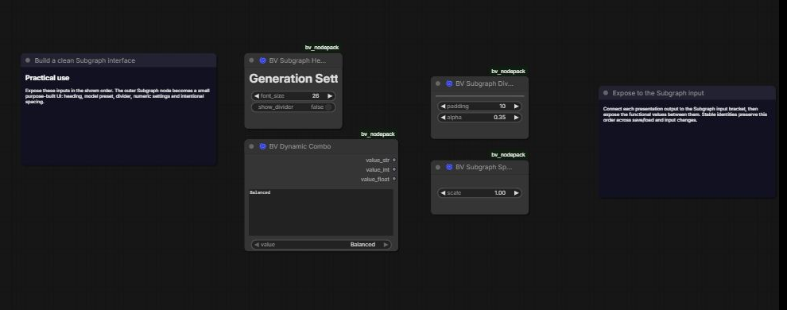](examples/images/subgraph-ui-layout.png)

| Node | Purpose |
| --- | --- |
| BV Subgraph Heading | A projected section title with optional divider |
| BV Subgraph Divider | A projected visual separator |
| BV Subgraph Spacer | Controlled vertical spacing |
| BV Dynamic Combo | A controlled choice that also emits string, integer and float views |

Presentation identity and serialized port identity remain separate so reload,
copying and nested Subgraphs do not reorder exposed controls.

To project one of these presentation nodes onto a Subgraph interface:

1. Create or open the Subgraph and add the presentation node between the controls
   it should visually separate.
2. Expose the node's left input as a Subgraph input.
3. Wire the surrounding data inputs to preserve the intended interface order.
4. Return to the parent graph. The exposed input is rendered as the heading,
   divider or spacer instead of an ordinary editable field.

<details>
<summary><strong>Heading: internal wiring and resulting Subgraph</strong></summary>

The heading input is exposed between the controls that should appear above and below it.

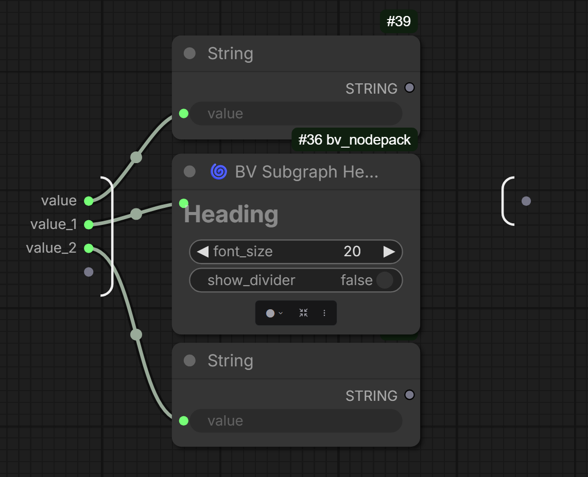

The parent Subgraph node renders that exposed position as a heading:

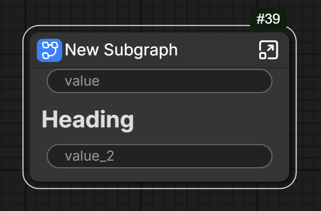

The heading text, font size and optional divider remain configurable on the inner node:

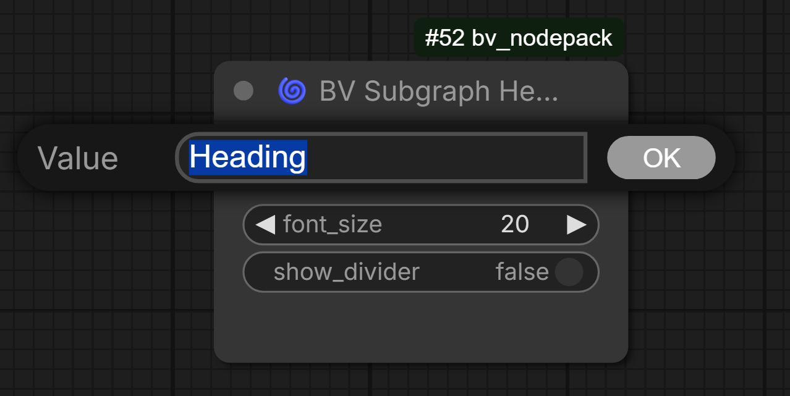

</details>

<details>
<summary><strong>Divider: internal wiring and resulting Subgraph</strong></summary>

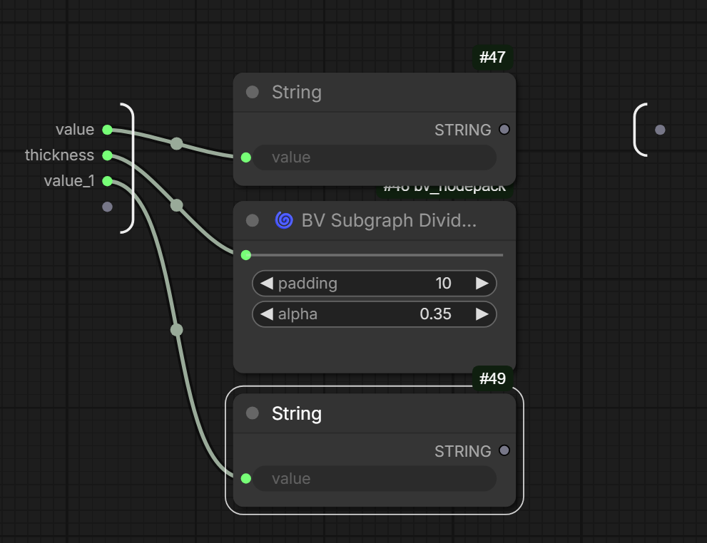

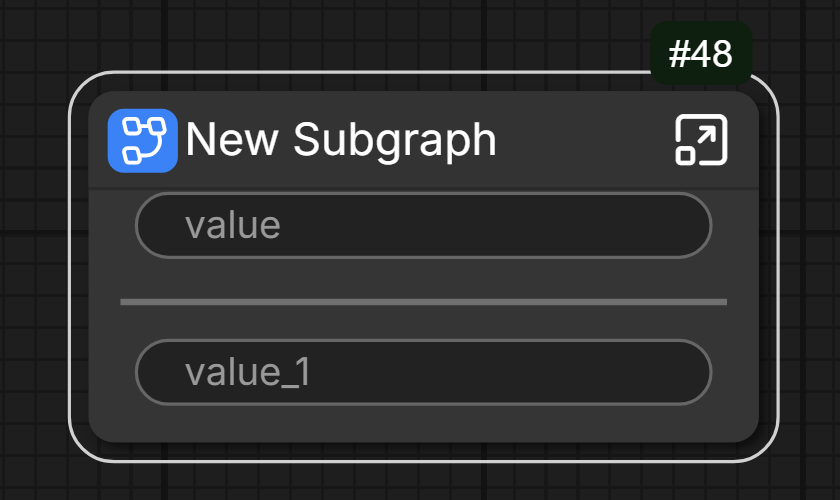

</details>

<details>
<summary><strong>Spacer: internal wiring and resulting Subgraph</strong></summary>

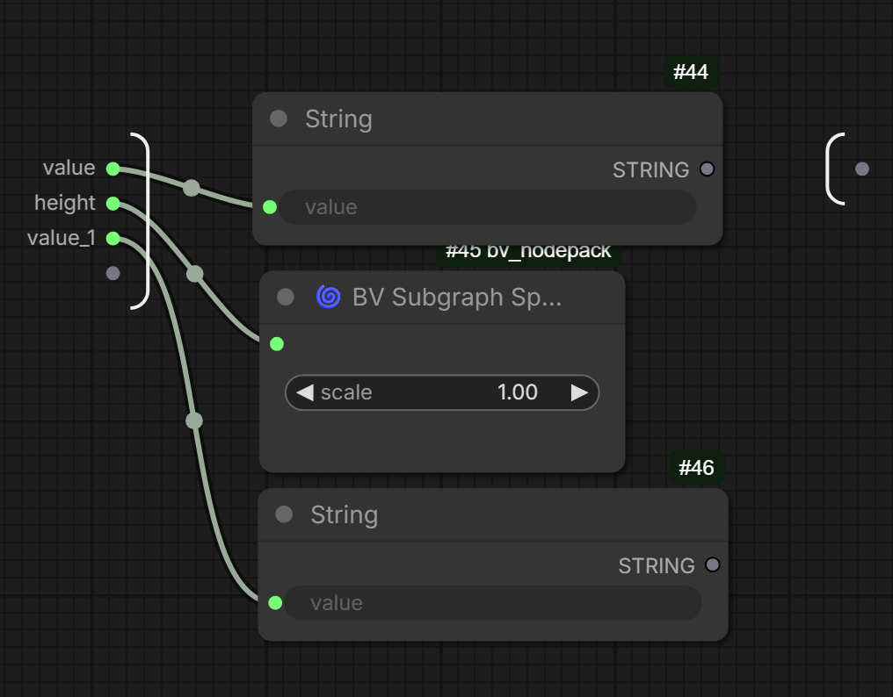

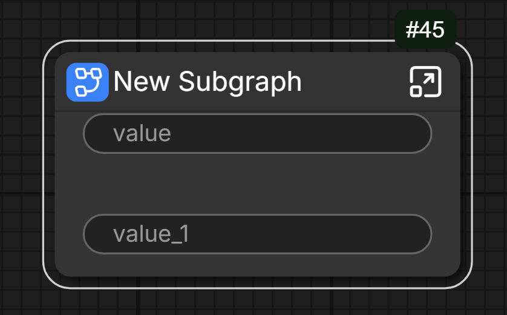

</details>

## Workflow control

**BV Control Center** defines named workflow states and applies explicit
`Activate`, `Mute` or `Bypass` actions to graph/Subgraph groups.

[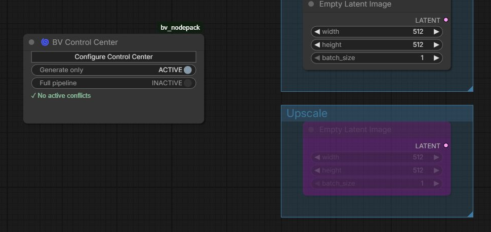](examples/images/control-center-workflow-states.png)

- Multiple Control Center nodes remain synchronized.
- Groups are discovered recursively in the root graph and inside Subgraphs,
  including nested Subgraphs, and are shown with their qualified Subgraph path.
- `Mute` and `Bypass` are applied to the nodes contained in the selected group,
  even when that group lives inside a Subgraph definition.
- A group belongs to its reusable Subgraph definition. If that definition has
  several instances, its controlled node modes therefore apply to every instance.
- Active conflicts resolve deterministically as `Activate > Mute > Bypass`.
- Conflicts and unresolved groups remain visible and block unsafe execution.
- Base node modes are restored when controls stop applying.

<details>
<summary><strong>Configure workflow states and group actions</strong></summary>

Each named state can assign `Activate`, `Mute` or `Bypass` to any discovered root
or Subgraph group.

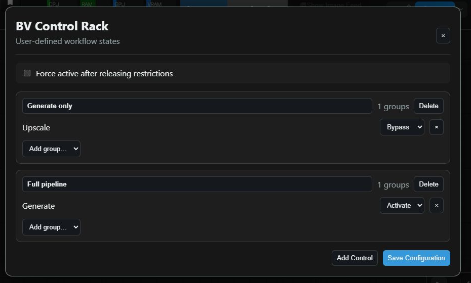

</details>

## Latent and utility nodes

| Node | Purpose |
| --- | --- |
| BV Empty Latent Random Ratio | Selects enabled aspect ratios deterministically while preserving approximate square pixel area |
| BV Latent Random Rotate 90 | Applies a seed-controlled 90-degree latent rotation |
| BV Seed | Provides fixed, random-each-queue and last-queued modes with Subgraph projection |
| BV Hex Color To Int | Converts three- or six-digit hex colors to integers |

[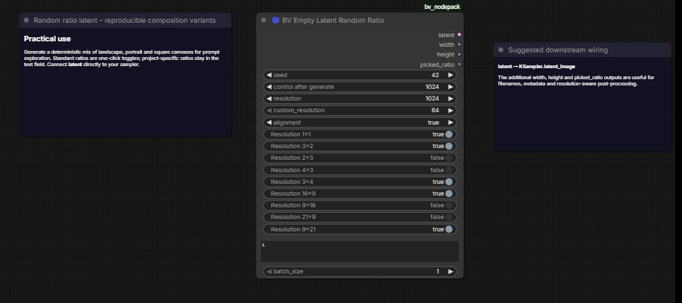](examples/images/empty-latent-random-ratio.png)

`BV Latent Random Aspect Ratio` is deprecated but retained for workflow compatibility.

## Example workflows

Workflow PNGs contain importable ComfyUI metadata; matching JSON files are provided
as metadata-independent fallbacks.

| Example | Preview | JSON |
| --- | --- | --- |
| Smart Pipe wireless merge | [PNG](examples/images/smart-pipe-wireless-merge.png) | [JSON](examples/workflows/smart-pipe-wireless-merge.json) |
| Control Center states | [PNG](examples/images/control-center-workflow-states.png) | [JSON](examples/workflows/control-center-workflow-states.json) |
| Subgraph UI layout | [PNG](examples/images/subgraph-ui-layout.png) | [JSON](examples/workflows/subgraph-ui-layout.json) |
| Random-ratio latent | [PNG](examples/images/empty-latent-random-ratio.png) | [JSON](examples/workflows/empty-latent-random-ratio.json) |
| Prompt AST categories | [PNG](examples/images/prompt-ast-categories.png) | [JSON](examples/workflows/prompt-ast-categories.json) |
| Anima regional android dance | [Workflow PNG](examples/images/anima-android-dance-regional-showcase.png) | [Regional document](docs/examples/anima-android-dance-regional-showcase.bv-regional.json) |

Regional document fixtures:

- [Anima: android dance with interaction overlap and painted light arc](docs/examples/anima-android-dance-regional-showcase.bv-regional.json)
- [Anima: two characters in a space station](docs/examples/anima-two-characters-space-station.bv-regional.json)
- [Krea 2: two women at a castle](docs/examples/krea2-two-women-castle.bv-regional.json)

## Architecture and compatibility

- Stable IDs are authoritative; names and labels are presentation.
- UI state is stored separately from semantic workflow documents.
- Optional model integrations load lazily and cannot prevent unrelated nodes from registering.
- Standard KSampler compatibility depends on the selected compiler/backend.
- Missing capabilities fail visibly instead of silently degrading prompt meaning.
- Nodes 2.0 and Subgraph behavior are tested independently from root-node rendering.

Technical references:

- [Regional schema v1](docs/specs/bv-regional-v1.md)
- [Global completion contract](docs/specs/bv-global-completion.md)
- [Regional Editor implementation notes](docs/regional-editor-mvp.md)
- [Smart Pipe contract ADR](docs/adr/0001-separate-smart-pipe-contract.md)
- [Renderer-independent Subgraph UI ADR](docs/adr/0002-renderer-independent-subgraph-ui.md)
- [Wireless Smart Pipe ADR](docs/adr/0003-wireless-smart-pipe-spine.md)
- [Third-party notices](THIRD_PARTY_NOTICES.md)

## Current scope

- Regional overlap execution currently supports `joint`; other modes are reserved.
- Native regional conditioning provides masks, not model-internal attention isolation.
- The built-in patched attention backend currently targets Anima.
- Regional negative isolation depends on backend capability.
- Region placement, overlap and strength guide conditioning but cannot guarantee
  exact object boundaries, poses, depth order or pixel-perfect interactions.
- Wireless Smart Pipe compatibility remains sensitive to upstream prompt lifecycle changes.

## Changelog

### 2026-08-17 — v0.3.2

- Add Registry icon and 21:9 Nodes Manager banner metadata.
- Publish the illustrated Regional Editor, Anima workflow and autocomplete documentation.
- Preserve Quick Edit synchronization and background-image display state across editor sessions.
- Extend selected brush layers and expose background-image opacity controls.

### 2026-08-17 — v0.3.1

- Extend BV Prompt Autocomplete to ordinary ComfyUI multiline text widgets.
- Keep completion keyboard handling local and provide explicit widget opt-out.
- Clean up listeners when nodes are removed and prevent duplicate adapter installation.

### 2026-08-17 — v0.3.0

- Add the BV-owned lazy CSV/TSV completion provider with extensible metadata.
- Add global/editor controls and ordered completion datasets.
- Bundle `bv_default_tags.csv` so completion has no runtime dependency on another node pack.

### 2026-08-17 — v0.2.0

- Add the model-neutral Regional Editor and document toolchain.
- Add native masked conditioning and built-in Anima attention backends.
- Add Quick Edit and preview/save image feedback senders.

### 2026-08-14 — v0.1.0

- Add Smart Pipe and native random-ratio empty latents.
- Harden AST, Dynamic Combo, Subgraph UI, Control Center, debug, rotation and hex nodes.

Earlier history remains available in the Git log.

## Acknowledgements

BV Node Pack is built on ComfyUI's extension ecosystem. Several open-source
projects helped shape its product ideas, interaction patterns and technical research:

- [ComfyUI](https://github.com/Comfy-Org/ComfyUI) and
  [ComfyUI Frontend](https://github.com/Comfy-Org/ComfyUI_frontend) provide the
  runtime, graph, Subgraph and extension foundations this pack integrates with.
- [rgthree-comfy](https://github.com/rgthree/rgthree-comfy) influenced the focus on
  fast workflow controls, compact graph tooling and practical seed/control UX.
- [ComfyUI_agilly1989_motorway](https://github.com/agilly1989/ComfyUI_agilly1989_motorway)
  was the original inspiration for configurable BV Pipes. Motorway demonstrated
  that a pipe could carry user-named values through a workflow and overwrite an
  existing key downstream instead of relying only on a permanently fixed port set.
  BV Smart Pipe developed that idea further with incremental slot inheritance,
  stable slot identities, independent branches, wireless routing and explicit merges.
- [cg-use-everywhere](https://github.com/chrisgoringe/cg-use-everywhere), commonly
  known as Use Everywhere, inspired the wireless-routing direction. Its approach
  demonstrated how values can be broadcast without visible graph links and how
  routing rules can disambiguate targets in complex workflows. BV Smart Pipe uses
  its own explicit predecessor, stable-address and branch/merge semantics.
- [ComfyUI-KJNodes](https://github.com/kijai/ComfyUI-KJNodes), especially the
  Ideogram regional prompt-builder workflow, inspired the idea of a dedicated
  editor surface that can remain available while navigating the graph.
- [ComfyUI_LC123_nodes](https://github.com/lonecatone23/ComfyUI_LC123_nodes)
  demonstrated painted regional authoring and provided useful Krea 2 and Anima
  workflow references.
- [Comfyui-Anima-Regional-Conditioning](https://github.com/Sen-sou/Comfyui-Anima-Regional-Conditioning)
  provided the technical basis for the built-in Anima patch. Its MIT attribution
  is reproduced in [Third-Party Notices](THIRD_PARTY_NOTICES.md).
- [RES4LYF](https://github.com/ClownsharkBatwing/RES4LYF) was studied as an
  architectural reference for regional attention, overlap and model-specific
  backends. BV does not copy its implementation.
- [comfy-ex-tagcomplete](https://github.com/jupo-ai/comfy-ex-tagcomplete) informed
  completion behavior and supplied the baseline public tag-data snapshot. BV uses
  its own completion implementation; dataset provenance is documented separately.

> **Thank you.** BV Node Pack would not have grown into its current form without
> the maintainers, researchers and workflow creators who share their code, ideas,
> experiments and hard-earned findings with the ComfyUI community. Their openness
> made it possible to study different approaches, learn from them and build something
> new on top of that collective knowledge. We sincerely appreciate the time and care
> behind every project acknowledged above.

Inspiration acknowledgements do not imply endorsement, affiliation or a runtime
dependency unless explicitly stated.

## License

BV Node Pack is licensed under **GNU GPL v3**. Third-party-derived components and
datasets are documented in [THIRD_PARTY_NOTICES.md](THIRD_PARTY_NOTICES.md).
