# BV Node Pack (ComfyUI)

A curated collection of **quality-of-life**, **UI**, and **prompting** nodes for **ComfyUI**, with a strong focus on:

- clean graph layouts
- Subgraph/Subflow compatibility
- metadata-driven pipelines
- AST-based prompt tooling (no fragile string parsing)

> ⚠️ **Important**
> This pack includes **JavaScript UI extensions** for dynamic node behavior.
> These extensions fully support **Subgraphs / Subflows**.

---

## 📌 Table of Contents

- [Installation](#installation)
- [Update & Uninstall](#update--uninstall)
- [Node Overview](#node-overview)
    - [Example Workflows](#example-workflows)
    - [Pipe Nodes](#pipe-nodes)
    - [UI / Layout Nodes](#ui--layout-nodes)
    - [Prompt / AST Nodes](#prompt--ast-nodes)
    - [Regional Prompting Nodes](#regional-prompting-nodes)
    - [Latent Nodes](#latent-nodes)
    - [Util Nodes](#util-nodes)
    - [Control Nodes](#control-nodes)
- [Prompt AST Syntax & Markup Guide](#prompt-ast-syntax--markup-guide)
- [Example application for AST](#example-application-for-ast)
- [Quick Start (BV Smart Pipe)](#quick-start-bv-smart-pipe)
- [Notes & Design Principles](#notes--design-principles)
- [Changelog](#changelog)

---

## Installation

Clone into your ComfyUI `custom_nodes` folder:

```bash
cd ComfyUI/custom_nodes
git clone https://github.com/BlackVortexAI/bv_nodepack.git
```

Restart ComfyUI and hard-refresh the browser:

**Ctrl + F5**

---

## Update & Uninstall

### Update

```bash
cd ComfyUI/custom_nodes/bv_nodepack
git pull
```

Restart ComfyUI (recommended).

### Uninstall

1. Delete the folder in `custom_nodes`
2. Restart ComfyUI
3. Hard refresh the browser (**Ctrl + F5**)

---

## Node Overview

Nodes are grouped by **functional category**.
Each section below can be read independently.

---

## Example Workflows

Each preview is also an importable ComfyUI workflow: download the PNG and drag it onto the canvas. The matching JSON is provided as a metadata-independent fallback.

<details open>
<summary><strong>Smart Pipe: wireless branches and ordered merge</strong></summary>

[](examples/images/smart-pipe-wireless-merge.png)

Two independently populated pipes are merged wirelessly and then inherited by the next processing stage. [Workflow JSON](examples/workflows/smart-pipe-wireless-merge.json)

</details>

<details>
<summary><strong>Control Center: reusable workflow states</strong></summary>

[](examples/images/control-center-workflow-states.png)

Multiple synchronized Control Center nodes manage grouped generation stages while showing their active state and conflict status directly on the graph. [Workflow JSON](examples/workflows/control-center-workflow-states.json)

</details>

<details>
<summary><strong>Subgraph UI: heading, combo, divider and spacer</strong></summary>

[](examples/images/subgraph-ui-layout.png)

The presentation nodes are arranged in the logical order in which they should be exposed on a purpose-built Subgraph interface. [Workflow JSON](examples/workflows/subgraph-ui-layout.json)

</details>

<details>
<summary><strong>Random-ratio latent for composition exploration</strong></summary>

[](examples/images/empty-latent-random-ratio.png)

A deterministic mix of common and project-specific aspect ratios feeds a sampler while width, height and ratio remain available for metadata and post-processing. [Workflow JSON](examples/workflows/empty-latent-random-ratio.json)

</details>

<details>
<summary><strong>Prompt AST: category-based prompt variants</strong></summary>

[](examples/images/prompt-ast-categories.png)

One structured prompt is filtered into a generation variant while the complete AST remains inspectable during workflow construction. [Workflow JSON](examples/workflows/prompt-ast-categories.json)

</details>

---

## Pipe Nodes

<details>
<summary><strong>BV Smart Pipe</strong></summary>

A chain-growing pipe with stable slot identities and per-node projections.

**What it does**
- Opens its schema editor through the Configure button or context menu
- Adds up to 100 local slots and inherits upstream slots
- Allows each node to expose only the inputs and outputs needed at that point
- Keeps branches independent and transports all values through the pipe connection
- Passes inherited values across bypassed Smart Pipe nodes without applying their local writes
- Treats a muted Smart Pipe as a temporary execution-branch stop without changing the saved workflow
- Omits muted Merge sources for the current run; a Merge with no active sources stops only its dependent branch
- Marks slots from a removed upstream producer as missing instead of shifting links
- Blocks execution when a missing slot is still connected

Slot types start as `*` and are persisted after inference from the first connection.

**Configure local slots**

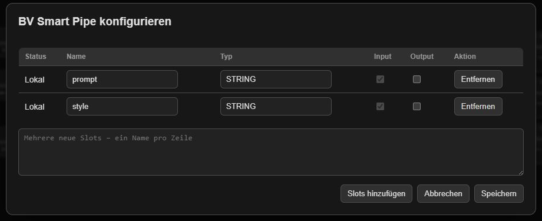

1. Add one or several local slot names.
2. Connect each local input so its type can be inferred and persisted.
3. Enable outputs only where a downstream node actually consumes the value.

> **Experimental:** Wireless routing, especially across Subgraph boundaries, depends on a prompt-materialization adapter because ComfyUI does not yet expose an official pre-prompt extension hook. Keep physical Pipe links for compatibility-critical workflows until the Nodes 2.0, partial-execution and third-party wrapper matrix has been completed.

</details>

<details>
<summary><strong>BV Smart Pipe Merge</strong></summary>

Combines several Smart Pipe branches in an explicit, user-defined order.

**What it does**
- Mixes wired and wireless Smart Pipe sources
- Adds wired sources through the temporary `Add Pipe Source` connector
- Adds wireless sources through the configuration dialog
- Prevents the same source from being selected more than once
- Keeps different stable slot IDs separate even when their visible names match
- Preserves a genuine branch write when a later source only inherited the shared base value
- Lets the later source win when several branches genuinely changed the same stable slot ID
- Exposes the merged Pipe Schema to subsequent Smart Pipe nodes
- Rejects missing sources and cycles instead of silently producing incomplete data

**Configure source order**

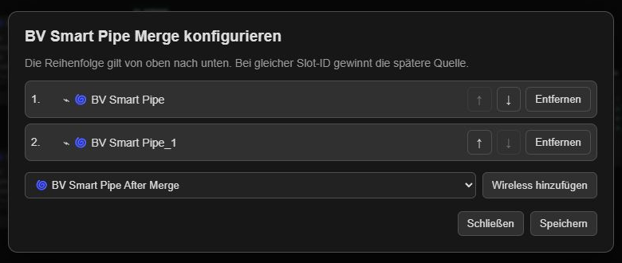

Wireless and wired sources share the same ordered list. For colliding stable Slot IDs, the later genuine branch write wins.

</details>

<details>
<summary><strong>BV Pipe Config [Deprecated]</strong></summary>

Defines the slot layout (names) for a BV Pipe.

**Screenshot**
> Shows the BV Pipe Config node with a multiline list of slot names.
>
> 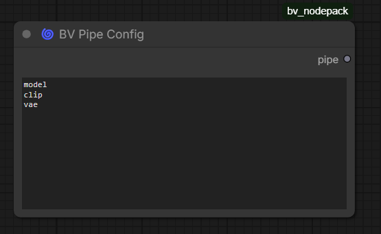

**What it does**
- Define slot names (1 per line, max 100)
- Outputs a single `BV_PIPE` object (the "pipe")

**How to use**
1. Add **BV Pipe Config**
2. Enter slot names (one per line)
3. Connect its `pipe` output to **BV Pipe**

</details>

<details>
<summary><strong>BV Pipe [Deprecated]</strong></summary>

A config-driven carrier node that forwards one pipe connection while exposing named slots.

**Screenshots**
> Connected state (slots visible)
>
> 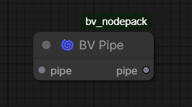

> Slot override example
>
> 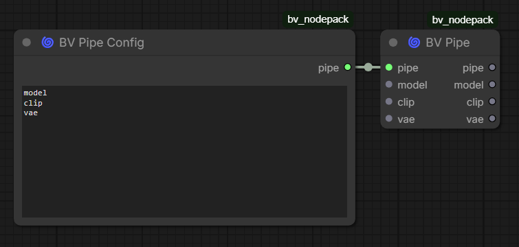

> Subgraph usage
>
> 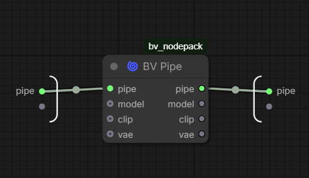

**What it does**
- Shows only the slots defined by the connected **BV Pipe Config**
- Allows overriding individual slots
- Passes through all untouched slots

</details>

---

## UI / Layout Nodes

<details>
<summary><strong>BV Subgraph Heading</strong></summary>

A UI node that renders a bold header text inside the node.

Designed specifically for **Subgraphs/Subflows**:
When exposed, the heading is also rendered on the Subgraph node itself.

**Screenshots**
> Heading inside normal graph
>
> 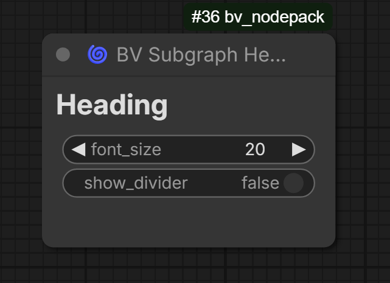

> Heading inside Subgraph
>
> 

> Heading rendered on Subgraph node
>
> 

> Editing the heading text (click on header text to edit)
>
> 

**Inputs**
- `value` (STRING) — header text
- `font_size` (INT) — font size
- `show_divider` (BOOLEAN) — optional divider

</details>

<details>
<summary><strong>BV Spacer</strong></summary>

A UI-only spacer node used to add vertical whitespace.

**Screenshots**
> Normal graph
>
> 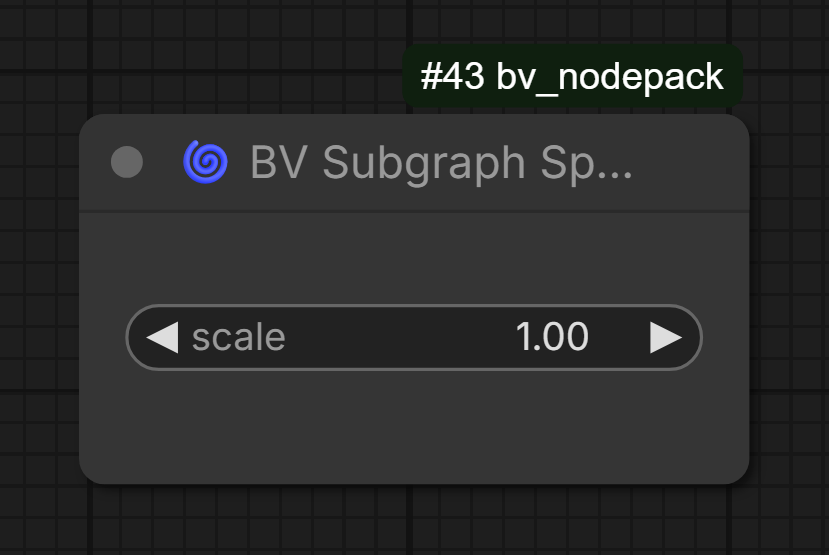

> Inside Subgraph
>
> 

> Subgraph node view
>
> 

> Editing the spacer height (click on spacer to edit)
>
> 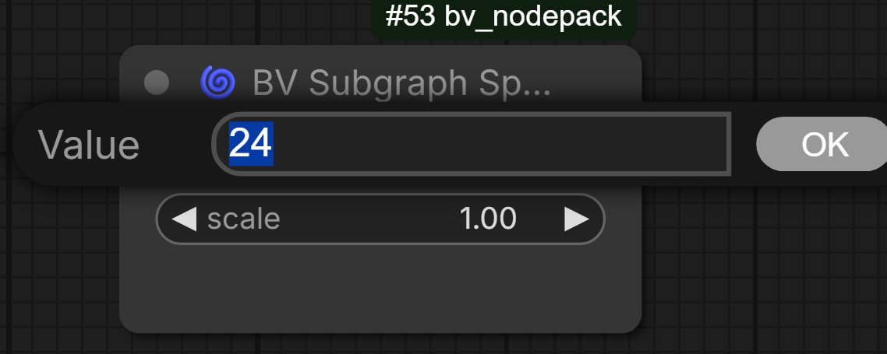

**Inputs**
- `height` (INT) — spacer height in pixels
- `scale` (FLOAT, optional) — multiplier

</details>

<details>
<summary><strong>BV Divider</strong></summary>

A UI-only divider node that draws a horizontal separator line.

**Screenshots**
> Divider in graph
>
> 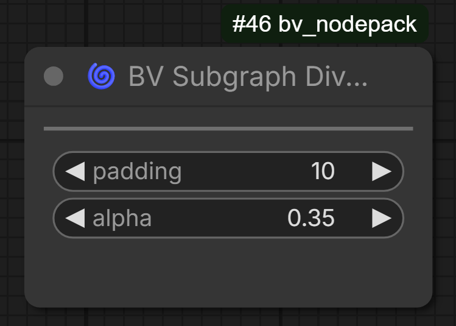

> Divider inside Subgraph
>
> 

> Divider rendered on Subgraph node
>
> 

**Inputs**
- `thickness` (INT)
- `padding` (INT)
- `alpha` (FLOAT)

</details>
<details>
<summary><strong>BV Dynamic Combo</strong></summary>

**Purpose**
- Creates a dynamic combo box from a list of strings

**Input**
- `prompt` (COMBO, STRING)

**Output**
- `value_str` (`STRING`)
- `value_int` (`INT`)
- `value_float` (`FLOAT`)
</details>

---

## Prompt / AST Nodes

> These nodes operate on a **structured AST (Abstract Syntax Tree)**, not on raw strings.
> This allows safe filtering, switching, inspection, and refactoring of prompts.

<details>
<summary><strong>BV Prompt Encode</strong></summary>

**Purpose**
- Parses a tagged prompt into an AST

**Input**
- `prompt` (STRING, multiline)

**Output**
- `ast` (`BV_AST`)
- `cleaned_prompt` (plain text, no markup, no comments)

Comment text is removed while its line break is preserved.

**Screenshot**
> Example output
>
> 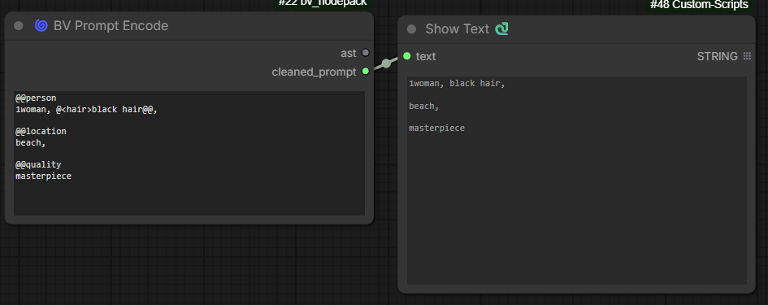

</details>

<details>
<summary><strong>BV Prompt Decode</strong></summary>

**Purpose**
- Extracts plain text from the AST by category

**Key Features**
- Multi-category filtering
- `any` / `all` matching
- Inheritance (parent categories)
- Optional prettify pass
- If no filter is set, all categories are displayed.

**Screenshot**
> Example output
>
> 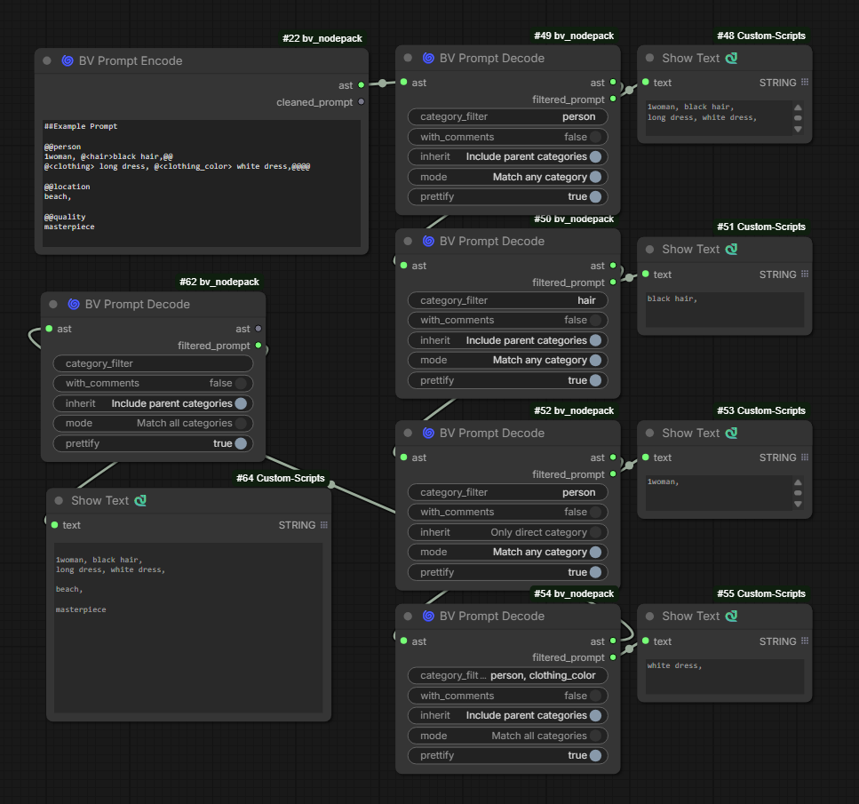

</details>

<details>
<summary><strong>BV Prompt AST Debug</strong></summary>

**Purpose**
- Visual inspection of the AST

**Features**
- JSON pretty-print
- Readonly, scrollable output field
- Safe for large ASTs

**Screenshot**
> Example output
>
> 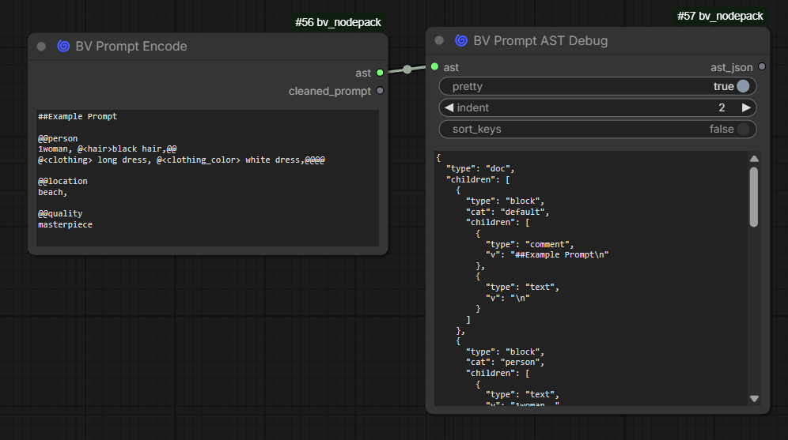

</details>

<details>
<summary><strong>BV Prompt Category Switch</strong></summary>

**Purpose**
- Enable / disable categories directly on the AST
- No string parsing

**Features**
- Enable categories
- Disable categories (wins over enable)
- `inherit` and `any/all` matching

**Screenshot**
> Example output
>
> 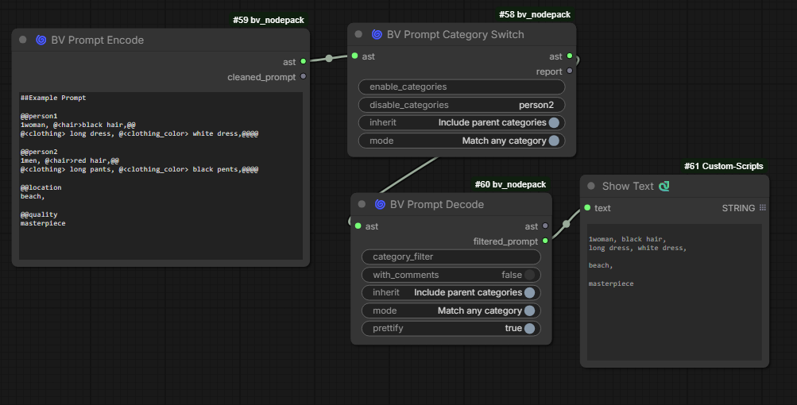

</details>

---

## Prompt AST Syntax & Markup Guide

This section explains the **exact prompt syntax** that is parsed into the AST.

### Default (no markup)
```text
A beautiful landscape, sunset lighting
```

### Block categories
```text
@@style
cinematic lighting
@@subject
a woman in rain
```

### Inline categories
```text
a portrait with @<eye> green eyes @@ and @<hair> black hair @@
```

### Nested inline categories
```text
@<subject> a @<face> smiling woman @@ in rain @@
```

### Comments
```text
a portrait ## this is a comment
```

### ⚠️ Common Syntax Pitfalls (Important)

Category names must not contain spaces.

Inline categories are only recognized if the category name matches this pattern:

>[a-zA-Z0-9_-]+


#### ❌ Invalid
```text
@<clothing color> white dress @@
```

✅ Valid
```text
@<clothing_color> white dress @@
```
### Closing inline categories (@@)
```text
@@ closes one currently open inline category
```

Every inline category must be closed. An unmatched `@@` or an unclosed inline
category raises an error with its line and column.
### ❌ Invalid (too many closings)
```text
@<clothing> long dress,@@@@
```

✅ Valid
```text
@<clothing> long dress,@@
```

## Example application for AST
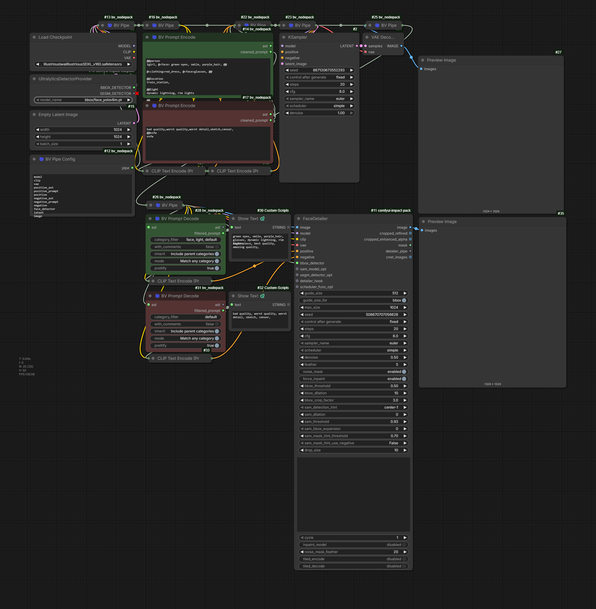
---

## Regional Prompting Nodes

The Regional toolset stores prompts and editable geometry in the model-neutral
`BV_REGIONAL` document format. The editor supports any number of named regions,
rectangles and brush layers, overlapping masks, priorities, undo/redo, quick
prompt editing, floating/workspace modes, and an optional background image.

**Core workflow**

1. Create a **BV Regional Prompt** node and open the editor from the node or toolbar.
2. Define the Global and Background prompts, then add and paint the required regions.
3. Connect the `regional` output to a model-specific compiler:
   - **BV Regional Native Conditioning** produces standard masked ComfyUI conditioning.
   - **BV Regional Anima Conditioning** applies the built-in Anima attention patch and works with a standard KSampler.
4. Optionally use **BV Regional Preview Send** or **BV Regional Save Send** to send the latest generated image back to a selected editor. If several senders execute, the last completed sender wins.

The editor document can also be inspected and reused through **Debug**, **Select**,
**Deconstructor**, **Prompt Extract**, and **Mask Render** nodes. The legacy
**Anima Adapter** remains available for workflows that intentionally use the
external Anima regional-conditioning package.

Prompt fields in the full editor and Quick Edit use the optional BV Local Tags
provider. It supports legacy four-column CSV data as well as extensible CSV/TSV
files with descriptions, provenance and future custom metadata. Put a dataset at
`data/completion/`. The bundled `bv_default_tags.csv` is selected by default, so no other custom-node package
is required. `BV_COMPLETION_DATASET` may override it with an absolute CSV/TSV path.
Dataset loading is lazy and cannot prevent the editor from opening.
Multiple enabled datasets are ordered by priority. For duplicate tags, the
topmost dataset supplies the completion entry and its metadata.

Autocomplete can be disabled globally in ComfyUI settings or from
`Edit → Prompt Autocomplete` inside the Regional Editor. Disable it when another
completion extension should own prompt fields. Integration with ordinary ComfyUI
text widgets remains a later completion adapter.

See [Regional Editor MVP](docs/regional-editor-mvp.md) for the document contract,
interaction details, model limitations, and validation scope.

---

## Latent Nodes

> A Collection of Latent Nodes.

<details>
<summary><strong>BV Latent Random Rotate 90</strong></summary>

**Purpose**
- Rotates a latent by 90 degrees deterministically based on seed if enabled

**Input**
- `latent` (LATENT)
- `seed` (INT)
- `enabled` (BOOLEAN)

**Output**
- `latent` (`LATENT`)
- `latent_width` (`INT`)
- `latent_height` (`INT`)


</details>

<details>
<summary><strong>BV Empty Latent Random Ratio</strong></summary>

**Purpose**
- Creates a native empty latent at a deterministic aspect ratio
- Preserves the approximate pixel area of a square resolution reference
- Supports 512, 768, 1024, 1536, 2048, and a custom resolution

**Input**
- `seed` (INT)
- `resolution` (512, 768, 1024, 1536, 2048, or Custom)
- `custom_resolution` (INT, used for Custom)
- `alignment` (8, 16, 32, or 64; default 8)
- Individual toggles for 1:1, 3:2, 2:3, 4:3, 3:4, 16:9, 9:16, 21:9, and 9:21
- `ratios` (optional multiline STRING for additional normalized `W:H` ratios)
- `batch_size` (INT)

**Output**
- `latent` (LATENT)
- `width` (INT, pixels)
- `height` (INT, pixels)
- `picked_ratio` (STRING)

</details>

`BV Latent Random Aspect Ratio` remains available for existing workflows but is deprecated.

## Util Nodes

> A Collection of Utility Nodes.

<details>
<summary><strong>BV Seed</strong></summary>

A Subgraph-capable seed controller with fast controls inspired by rgthree's Seed node.

- `-1` remains visible and stored as the random-each-queue sentinel instead of being replaced after execution
- Quick actions select random-each-time, generate a new fixed random seed, or reuse the last queued seed
- The complete control — editable seed value and all three actions — is projected onto Subgraph nodes
- Only one public control is exposed: it is stored internally as `seed_bv` and displayed as `seed`
- At queue time, the frontend materializes a concrete value into the API prompt while leaving the saved UI state untouched
- The node still outputs a regular `INT` seed for samplers and other seed consumers

</details>

<details>
<summary><strong>BV Hex Color To Int</strong></summary>

**Purpose**
- Converts a three- or six-digit HEX color code to an INT value

**Input**
- `hex` (STRING, `#RGB`, `RGB`, `#RRGGBB`, or `RRGGBB`)

**Output**
- `color` (`INT`)


</details>

## Control Nodes

<details>
<summary><strong>BV Control Center</strong></summary>

Centralized runtime control for explicit **activate / mute / bypass** states of node groups.

**Key Features**
- User-defined, case-sensitive Controls with stable IDs
- Stable group assignments displayed with their full graph/subgraph path
- Multiple synchronized Control Center nodes and subgraph exposure
- Controls participate only while their toggle is `ACTIVE`; `INACTIVE` Controls do not apply assignments
- Deterministic overlap resolution with `Activate > Mute > Bypass`
- Conflicting active assignments are explained in the Rack and in a persistent Node status row
- Optional Force Active behavior; otherwise each node's base mode is restored
- Unresolved groups remain visible and block execution while their Control is active
- Event-driven updates without polling or retry loops

**Configure workflow states**


1. Create a named Control such as `Generate only` or `Full pipeline`.
2. Assign one or more graph or Subgraph groups.
3. Choose `Activate`, `Mute`, or `Bypass` for each assignment.
4. Save once; every synchronized Control Center node updates immediately.


</details>

---

## Quick Start (BV Smart Pipe)

For new workflows, add **BV Smart Pipe**, open **Configure Smart Pipe**, and add
only the slots needed at that point in the chain. The following legacy setup is
kept for existing workflows only.

1. Add **BV Pipe Config** and enter slot names:

```txt
model
clip
vae
seed
prompt
```

2. Connect:

`BV Pipe Config (pipe)` → `BV Pipe (pipe)`

3. Optionally override individual slots.

---

## Notes & Design Principles

- Smart Pipe slots use stable logical IDs; `v_001…` are only their persisted physical connector ordinals.
- Legacy `BV Pipe` retains its fixed 100-slot contract solely for existing workflows.
- Labels are user-defined and dynamic
- UI nodes are rendered via JavaScript
- All UI nodes support Subgraphs / Subflows
- Prompt nodes operate on **AST**, not raw strings

---

## Changelog

### 2026-08-17 — v0.3.0
- Add the BV-owned lazy CSV/TSV completion provider with extensible metadata.
- Add global and editor-local controls for disabling prompt autocomplete.
- Bundle `bv_default_tags.csv` so completion has no runtime dependency on another custom-node package.

### 2026-08-17
- v0.2.0 — Add the model-neutral BV Regional Editor and document toolchain.
- Add native masked-conditioning and built-in Anima attention backends for standard KSampler workflows.
- Add Quick Edit plus preview/save image senders with stable editor targeting.
- Add the first optional prompt-autocomplete provider bridge.

### 2026-08-14
- v0.1.0 — Add BV Smart Pipe and native random-ratio empty latents; harden AST, Dynamic Combo, Subgraph UI, Control Rack, debug, rotation, and HEX nodes.

### 2026-01-29
- v0.0.24 — Make subgraph UI widgets more rebuild-safe.

### 2026-01-11
- v0.0.23 — Add BV Latent Random Aspect Ratio node.
- v0.0.22 — Change the category of BV Dynamic Combo. Add 90 Latent Rotate Node.

### 2026-01-10
- v0.0.21 — Add dynamic combo box node
- v0.0.20 — Add a HEX color to INT node

### 2026-01-02
- v0.0.19 — Update README: add AST example image with embedded workflow
- v0.0.18 — Add AST Prompting system
- v0.0.17 — Changed toggle label system (`BV Control Center`)
- v0.0.16 — Renamed inputs to avoid collisions

### 2026-01-01
- v0.0.15 — Fix subgraph renaming bug
- v0.0.14 — Widget fixes for subgraph usage

### 2025-12-31
- v0.0.13 — Fix label inversion error
- v0.0.12 — Fix input error
- v0.0.11 — Reworked renaming logic

### 2025-12-30
- v0.0.10 — Fix widget create event

### 2025-12-29
- v0.0.9 — Fix subgraph issues
- v0.0.8 — Major refactor to TypeScript

