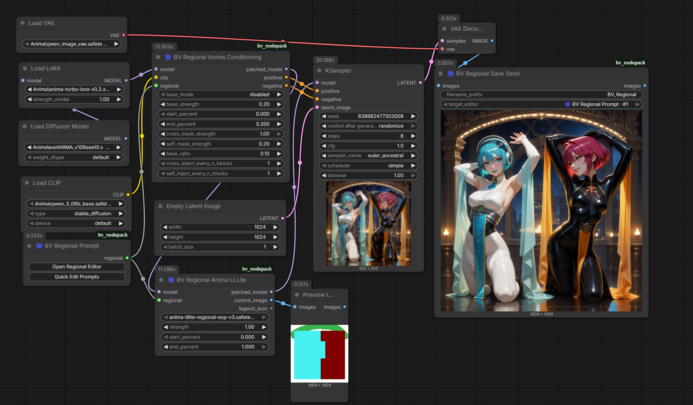
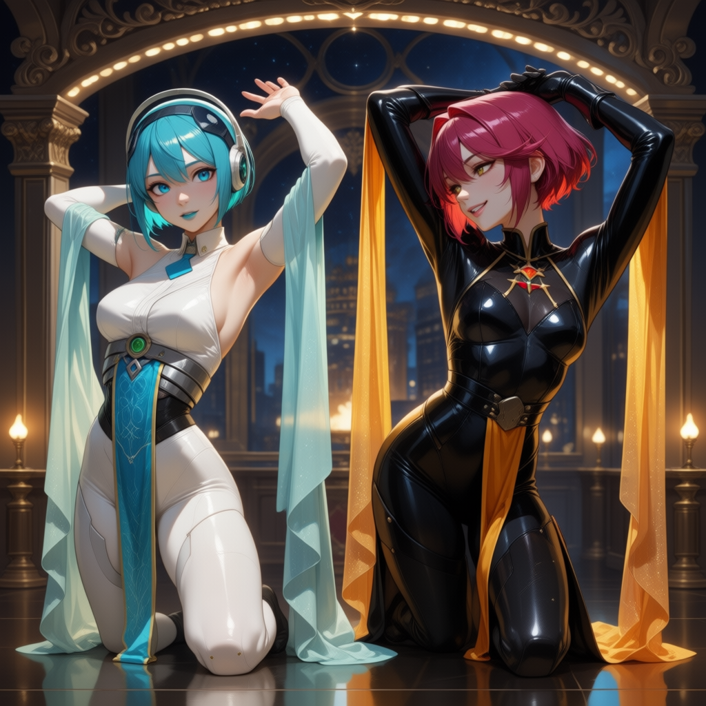

# Anima LLLite regional-control guide

BV Regional supports two complementary Anima mechanisms:

1. **BV Regional Anima Conditioning** binds Global, Background and regional prompt
   contexts to their masks inside Anima attention.
2. **BV Regional Anima LLLite** supplies a learned color-layout signal through
   ComfyUI's native model-patch runtime.

Neither mechanism is hard segmentation. Together they make prompt assignment and
layout more predictable while preserving the generative model's interpretation.

## What controlled patching means

The regional LLLite file is loaded as ComfyUI type `MODEL_PATCH`. It is not loaded
through the classic `CONTROL_NET` interface and does not emit positive or negative
conditioning. ComfyUI injects the lightweight adapter into supported Anima model
operations for a configurable part of the denoising schedule.

BV owns only the adapter around that runtime:

- compile `BV_REGIONAL` into the required RGB control image;
- load a user-selected local model-patch file;
- invoke ComfyUI core's `ModelPatchLoader` and `AnimaLLLiteApply` implementation;
- return the patched `MODEL`, rendered `IMAGE` and deterministic `legend_json`.

BV does not copy the external custom-node implementation, download weights or
silently install Python dependencies.

## Installation

1. Download the experimental regional adapter from
   [Sen-sou/Anima-LLLite-Regional-Controlnet](https://huggingface.co/Sen-sou/Anima-LLLite-Regional-Controlnet).
2. Place its `.safetensors` file in:

   ```text
   ComfyUI/models/model_patches/
   ```

3. Restart the ComfyUI Python process. A browser refresh alone does not refresh
   the server-side model-patch filename list.
4. Select the file in **BV Regional Anima LLLite**.

The model weights are intentionally not part of BV Node Pack.

## Correct workflow

```text
Load Diffusion Model
        |
optional model-only LoRA
        |
BV Regional Anima Conditioning <----- CLIP
        |                         <----- BV Regional Prompt
        | patched_model
        v
BV Regional Anima LLLite         <----- same BV Regional Prompt
        |
        +---- patched_model ------------> KSampler model
        +---- control_image ------------> Preview/Save Image (optional)
        +---- legend_json --------------> debug/downstream tooling (optional)

BV Regional Anima Conditioning positive -> KSampler positive
BV Regional Anima Conditioning negative -> KSampler negative
```

The order matters. LLLite must receive the already patched model from **BV Regional
Anima Conditioning** when both mechanisms are used. Bypassing LLLite then gives the
KSampler the Anima-Conditioning model directly, which creates a clean A/B comparison.



The captured UI still shows KSampler `randomize`; for reproducible comparisons,
set its control-after-generate mode to `fixed`.
The metadata-bearing reference images below were verified to contain the same
executed seed and all equal sampler/model/prompt inputs except for the LLLite path.

## Color-control contract

`BV Regional Color Control Image` and the combined LLLite node use the same compiler:

- output resolution comes from the regional document canvas;
- background is exact RGB white `(255, 255, 255)`;
- every enabled region receives one stable, document-independent control color;
- editor display colors are ignored;
- region feather and brush opacity cannot create blended control colors;
- disabled regions are omitted;
- a lower numeric priority wins an overlapping pixel (`P0` before `P1`);
- `legend_json` records region ID, name, priority, hex color and normalized RGB.

The verified `1024 × 1024` reference control image contains exactly four RGB values:

| Meaning | RGB | Pixel count |
| --- | --- | ---: |
| Background | `255, 255, 255` | 188,345 |
| Cyan character region | `70, 240, 240` | 430,705 |
| Dark-red character region | `128, 0, 0` | 345,917 |
| Painted light-arc region | `60, 180, 75` | 83,609 |


The colors are identifiers, not semantic assignments such as “cyan means the left
prompt.” LLLite does not know which regional prompt belongs to a color. That binding
comes from BV's regional attention backend or explicit spatial wording.

## Parameters

### Strength

Strength scales the influence of the LLLite model patch.

- `1.0`: strong layout guidance and the verified showcase setting;
- `0.5`: more freedom for pose, framing and interaction, with weaker adherence to
  the authored region extents;
- values above `1.0` are technically accepted by ComfyUI but should be treated as
  experimental rather than automatically better.

### Start and end percent

The sampling interval controls when the model patch is active.

- `0.0–1.0`: strongest continuous guidance; verified showcase setting;
- `0.0–0.35`: establishes layout early and releases later sampling to the base
  model, but the tested full-body composition showed less reliable lower-body framing;
- `start_percent` must not exceed `end_percent`; BV rejects an inverted interval.

Use `1.0 / 0.0–1.0` as the conservative starting point. Tune downward only when a
composition needs more freedom.

## Verified A/B behavior

The following images share executed seed `766291715444885`, Anima model, CLIP,
Turbo LoRA, `1024 × 1024` latent, regional document, positive/negative conditioning,
8 steps, CFG `1.0`, Euler ancestral, simple scheduler and denoise `1.0`.

| LLLite active — Strength 1.0, 0.0–1.0 | LLLite bypassed |
| --- | --- |
| [](assets/regional/anima-lllite-active.png) | [](assets/regional/anima-lllite-bypass.png) |

Observed in this test:

- regional character appearance remains separated in both images because BV
  Regional Anima Conditioning remains active;
- LLLite keeps the two subjects at a more comparable scale and depth;
- bypass allows a stronger foreground/background hierarchy;
- the painted control arc influences the generated stage lighting/layout;
- the small overlapping interaction region still does not guarantee physical contact.

These observations describe this controlled test, not a universal quality promise.

## Limits and troubleshooting

- **No positive/negative outputs:** expected. Use BV Regional Anima Conditioning
  for KSampler conditioning.
- **Empty patch selector:** place the file under `models/model_patches/` and restart
  ComfyUI completely.
- **Different image with an apparently identical seed:** inspect PNG prompt metadata,
  not only the visible widget. Use `fixed`, and keep model, LoRA, sampler, schedule,
  conditioning, patch state and latent size identical.
- **Subject extends outside a region:** expected. Regions bias attention/layout; they
  are not pixel masks for the final output.
- **Overlap does not force interaction:** expected. Priority resolves the single RGB
  control pixel, while joint regional attention allows both prompt contexts. A clear
  Global action prompt is still needed.
- **Other model families:** this convenience backend is Anima-specific. The standalone
  color compiler is model-neutral, but another model requires a compatible consumer.
- **Single-frame/runtime constraints:** behavior follows the installed ComfyUI core
  implementation and may change as its experimental model-patch API evolves.

## Licensing and redistribution boundary

The relevant artifacts have separate terms:

- BV adapter/compiler code is distributed under the BV Node Pack license.
- ComfyUI supplies the native runtime used by this node.
- The regional LLLite weight repository is published separately by Sen-sou and is
  not redistributed by BV.
- Anima base-model and derivative-model terms may impose additional restrictions
  beyond the adapter repository's label. Users are responsible for reviewing the
  current [Anima license](https://huggingface.co/circlestone-labs/Anima/blob/main/LICENSE.md)
  and the terms of every model/adapter they install.

This documentation is a conservative interoperability statement, not legal advice.

## Thanks and acknowledgements

Thank you to:

- [Sen-sou](https://huggingface.co/Sen-sou) for publishing and documenting the
  experimental regional Anima LLLite adapter;
- [kohya-ss/ComfyUI-Anima-LLLite](https://github.com/kohya-ss/ComfyUI-Anima-LLLite)
  for the LLLite ComfyUI implementation work and format documentation;
- [ComfyUI](https://github.com/Comfy-Org/ComfyUI) for integrating the native
  `MODEL_PATCH` loader and Anima LLLite application runtime;
- [CircleStone Labs](https://huggingface.co/circlestone-labs/Anima) and the Anima
  contributors for the underlying model ecosystem.

Their work made this interoperability layer possible. BV's goal is to provide a
model-neutral authoring contract and a maintainable connection to those capabilities,
not to obscure or repackage their work.
