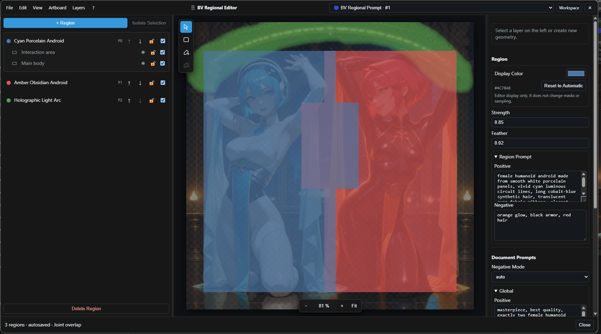

# BV Regional Editor Guide

The BV Regional Editor authors a model-neutral `BV_REGIONAL` document. Geometry,
prompts and authoring metadata are stored once; model-specific compiler nodes
decide how much of that contract a backend can execute.

The reference document behind this image uses two rectangle layers per character:
a main body area and a smaller shared interaction area. A third, painted region
guides the golden light arc.

[Import the workflow PNG](../examples/images/anima-android-dance-regional-showcase.png)
· [Import the regional document](examples/anima-android-dance-regional-showcase.bv-regional.json)

## Minimal workflow

1. Add **BV Regional Prompt**.
2. Open the editor from the node or the BV toolbar action.
3. Define Global and Background prompts.
4. Add named regions and create rectangle or brush geometry.
5. Connect `regional` to a supported compiler.
6. Connect the compiler outputs to a standard KSampler.

| Backend | Connect | Behavior |
| --- | --- | --- |
| Native/Krea-style | `BV Regional Native Conditioning` | Standard ComfyUI masked conditioning; no model attention patch |
| SDXL attention | `BV Regional SDXL Attention` | Model-internal cross-attention routing; verified with WAI Illustrious SDXL and Pony Diffusion V6 XL; standard KSampler |
| Anima | `BV Regional Anima Conditioning` | Built-in Anima attention patch; standard KSampler |
| Anima LLLite layout | `BV Regional Color Control Image` or `BV Regional Anima LLLite` | Solid color control image; optional native ComfyUI model-patch apply |
| External Anima fallback | `BV Regional Anima Adapter` | Compiles for the optional Sen-sou node pack |

## Editor layout

| Area | Purpose |
| --- | --- |
| Left panel | Regions, priority order, geometry layers, visibility, lock and selection |
| Artboard | WYSIWYG canvas, background preview, masks, selection handles, zoom and pan |
| Right panel | Region strength, feather, prompts and document prompts |
| Top menu | Import/export, undo/redo, display controls, canvas settings, completion data and help |
| Floating tool strip | Select, rectangle, additive brush and subtractive brush |

Panel widths, open sections, active selection, zoom/pan and window geometry are
saved separately per `document_id`. They never alter the semantic regional document.

<strong>Workspace and floating layouts</strong>

Floating mode remains at viewport scale while the graph is zoomed or panned.

<strong>Node and toolbar entry points</strong>

## Geometry and layers

- Rectangles and ellipses support independent Add/Subtract tools, live previews, move and eight resize handles.
- Polygons use click-to-place vertices; press `Enter` or double-click to close and `Escape` to cancel.
- Active Add/transform gestures use a cyan outline. Subtract gestures use a dashed red outline. The overlay includes live canvas-pixel dimensions and does not alter the document.
- Brush layers support round/square tips, size, hardness, opacity and optional stylus pressure.
- Subtractive shapes and brush strokes modify the selected unlocked compound mask; they do not create unrelated layers or white masks.
- Regions and layers can be renamed, reordered, locked, hidden, disabled, duplicated or deleted.
- Ctrl-click toggles individual layer selection; Shift-click selects a contiguous layer range.
- **Layers > Merge Selected Layers** (`Ctrl E`) combines selected Rectangle and Brush layers inside one region without changing their rendered Add/Subtract result.
- Merged compound layers retain independent internal mask groups, so an existing subtract operation never starts erasing geometry that belonged to another source layer.
- **Layers > Split Compound Layer** (`Ctrl Shift E`) restores those retained mask groups as independently editable layers without changing the rendered mask.
- A region receives an automatic display color. **Region > Display Color** can override it, and **Reset to Automatic** restores the palette color. This authoring color never changes mask output or sampling.
- **Layers > Split Disconnected Areas** rasterizes the selected layer at the document canvas resolution and turns every disconnected visible island into an independent raster-mask layer. This is intentionally destructive for vector editing; Undo restores the original Rectangle/Brush operations.
- Regions may overlap. Version 1 executes the overlap mode `joint`.
- Canvas width and height control the authoring aspect ratio even when no background exists.

Mask overlay opacity and background-image opacity are display-only settings. They
do not change exported masks, regional strength or the image returned by a sender.
**View > Binary Mask Preview** displays the resolved enabled mask in black and white,
including region feather, and blocks drawing or transforms while inspection is active.

<strong>Display controls</strong>

<strong>Reference document geometry</strong>

The main layers guide the two character designs. The smaller rectangles overlap
where their hands should meet, while the brush region demonstrates freehand geometry.

## Prompts

Each document contains:

- Global positive and negative prompts;
- Background positive and negative prompts;
- positive and negative prompts per region;
- per-region strength and feather;
- negative mode, including the technical zero-out path.

Global prompting establishes composition and concepts across the image. Regional
prompts should usually describe local attributes rather than duplicate the entire
scene. A region guides where conditioning applies; it is not a hard object boundary.

## How strict is regional guidance?

Regional prompting and attention masking bias where prompt information is available;
they do not clip a generated object to a mask. Results still depend on the model,
seed, sampler, prompt composition, mask geometry and backend implementation.

- A subject may extend beyond its region or appear slightly offset from it.
- Attributes may bleed between nearby or strongly overlapping regions.
- A small interaction region can make both regional contexts available around a
  contact point, but it cannot guarantee joined hands, eye contact or another pose.
- Region strength controls conditioning influence. Raising it does not turn the
  region into a stricter bounding box and can overemphasize local concepts.
- Global prompts can still influence composition and placement across the full image.

Treat masks as spatial intent. Validate important layouts across several seeds and
adjust geometry, prompt wording and backend settings together.

## SDXL attention backend

`BV Regional SDXL Attention` is the strong regional backend for compatible SDXL
checkpoints. It clones and patches the input model, independently encodes Global,
Background and region prompts, and applies their spatial availability inside SDXL
cross-attention. It does not require a custom sampler.

- Global context remains available across the full latent.
- Background context is available in the uncovered remainder.
- Region contexts are available inside their rendered masks.
- `joint` overlap exposes all overlapping regional contexts.
- Positive and negative branches use the same regional document semantics.
- Non-SDXL architectures fail with an explicit compatibility error.

Start with Attention Strength `1.0`, Start `0.0`, End `0.5`. A longer interval can
increase spatial adherence but may reduce the model's freedom to reconcile composition
and fine details. This control is separate from each region's own Strength value.
Attention Strength `0` is not a bypass: it disables regional and Background slots while
Global remains active. Bypass the node when comparing against an unpatched model path.

The current interactive compatibility matrix is:

| Checkpoint family | Status | Evidence |
| --- | --- | --- |
| WAI Illustrious SDXL | Verified | Two full-body subjects, contrasting hair/outfit attributes, Background routing and slight overlap |
| Pony Diffusion V6 XL | Verified | Contrasting regional attributes and placement; stronger out-of-the-box isolation than the untuned Native baseline |
| Other SDXL checkpoints | Expected, unverified | Shared SDXL architecture; test before relying on production behavior |

The Native comparisons use identical generation settings without backend-specific
tuning. They demonstrate the default behavior observed in these workflows, not a
claim that Native Conditioning cannot improve with adjusted strength, masks, feather
or prompt weighting.

## Workspace, floating and Quick Edit

Workspace mode fills the available browser viewport. Floating mode is independently
movable and resizable and remains unaffected by graph zoom or pan.

Quick Edit changes Global, Background or one selected region without opening the
full artboard. It targets stable document and region IDs even though the UI shows names.

<strong>Quick Edit over a live workflow</strong>

## Background feedback

- **BV Regional Preview Send** returns a temporary preview to a selected editor.
- **BV Regional Save Send** saves normally and returns the saved result.
- Multiple senders use last-completed-sender-wins semantics.
- Images are not embedded as Base64 in the workflow document.

This makes it possible to redraw masks over the latest sampler, detailer or upscale
result without creating a workflow cycle.

## Prompt autocomplete

BV Prompt Autocomplete works in the full editor, Quick Edit and ordinary ComfyUI
multiline widgets. Tags from the default dataset are inserted with spaces while the
canonical underscore form remains available as metadata.

Autocomplete is optional. Disable it under **Settings → BV Node Pack → Prompting**
or from **Edit → Prompt Autocomplete** when another extension should own prompt fields.
Several CSV/TSV datasets may be enabled and ordered; the topmost source wins duplicate tags.
Suggestions open at the active caret by default. Change **Autocomplete Popup Position**
to **Below Text Field** in the same settings section, or use **Edit → Popup Position**
inside the Regional Editor, to restore field-aligned placement.

<strong>Completion surfaces</strong>

<strong>Dataset settings and priority</strong>

## Document tools

| Node | Use |
| --- | --- |
| BV Regional Debug | Canonical JSON, summary and stable `document_id` |
| BV Regional Select | Select Global, Background or a named region |
| BV Regional Deconstructor | AST, plain text, source text and reusable selection |
| BV Regional Prompt Extract | Extract positive/negative AST and text |
| BV Regional Mask Render | Render mask plus pixel bounding box |

These seams are intended for later detailer adapters and other consumers without
coupling them to the editor UI.

## Anima reference workflow

The built-in Anima path has been verified with two independently conditioned
characters, joint interaction overlap, a painted light region and a standard KSampler.

<strong>Minimal workflow</strong>

Import either the metadata-bearing
[`workflow PNG`](../examples/images/anima-android-dance-regional-showcase.png)
or the editor-only
[`regional document`](examples/anima-android-dance-regional-showcase.bv-regional.json).

### Experimental LLLite composition

`BV Regional Color Control Image` deterministically converts every enabled region
to one solid control color on a white background. Display colors are intentionally
ignored, feathering does not create mixed colors, and the lower numeric priority
wins an overlap. Its `legend_json` is intended for inspection and downstream tools.

`BV Regional Anima LLLite` additionally loads a user-installed `MODEL_PATCH` from
`ComfyUI/models/model_patches/` and calls ComfyUI core's Anima LLLite runtime. The
regional weights are not shipped or downloaded by BV; obtain them from
[Sen-sou's model repository](https://huggingface.co/Sen-sou/Anima-LLLite-Regional-Controlnet).
The adapter supplies layout guidance, not prompt/color binding. Its combination
with the BV Anima attention backend has been validated with a controlled
active/bypass render and pixel-checked control image, but remains experimental
because it composes two model-patching mechanisms. See the dedicated
[`Anima LLLite regional-control guide`](anima-lllite-regional-control.md) for the
patch order, verified settings, A/B images, limitations and licensing boundary.

## Current limits

- `joint` is the only executable overlap mode; normalized, exclusive and priority modes are reserved.
- Native masked conditioning does not provide model-internal attention isolation.
- Built-in attention backends currently target Anima and SDXL-family models; other model families require future adapters.
- Parent-region IDs exist in the schema, but hierarchy authoring is not exposed yet.
- Regional negative isolation depends on backend capability.
- A region is conditioning guidance, not a guaranteed object-sized bounding box,
  exact pose constraint or pixel-perfect interaction target.

For the formal schema and implementation boundaries, see
[`docs/specs/bv-regional-v1.md`](specs/bv-regional-v1.md) and
[`docs/regional-editor-mvp.md`](regional-editor-mvp.md).
